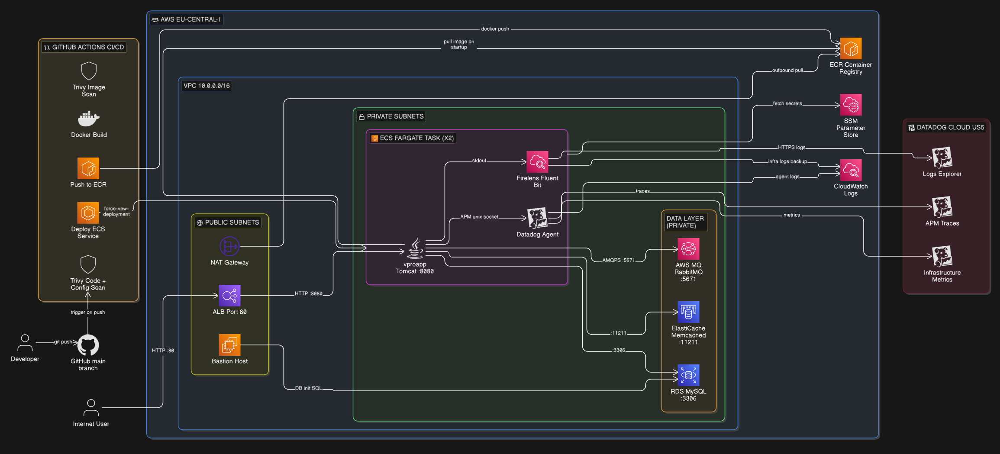
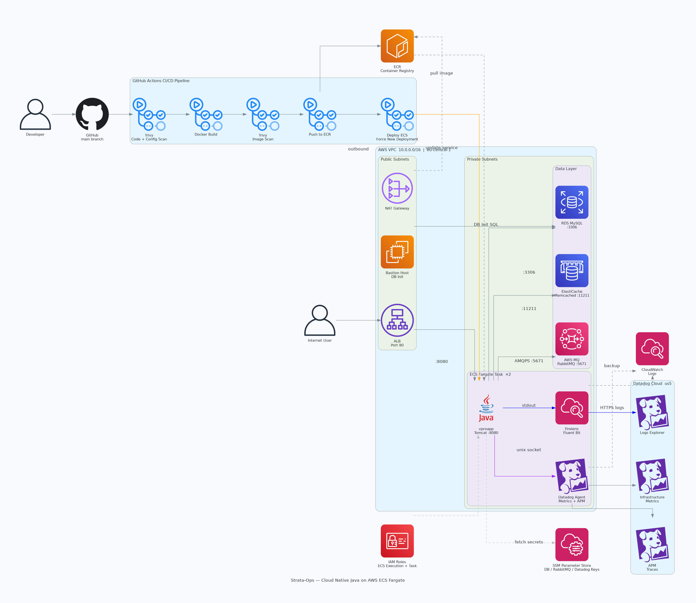
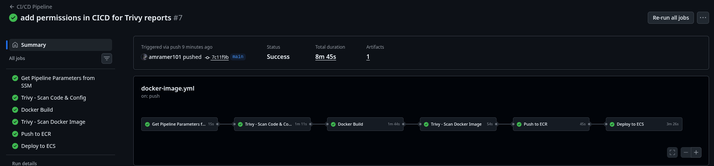
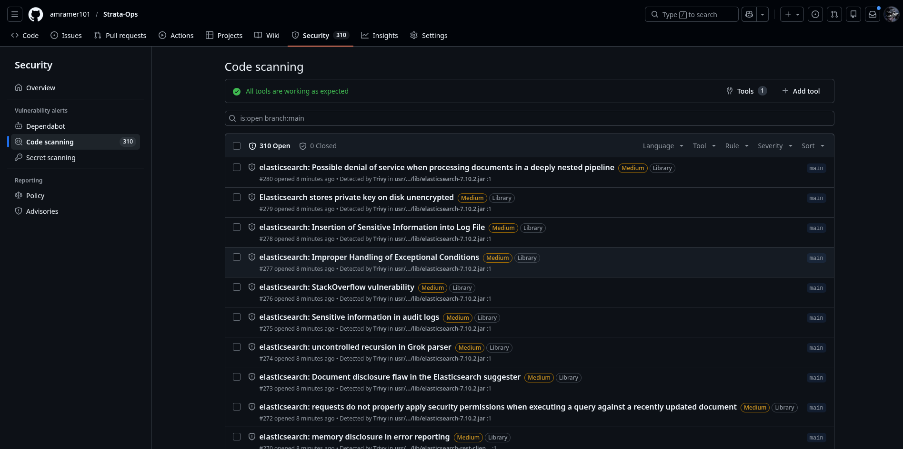
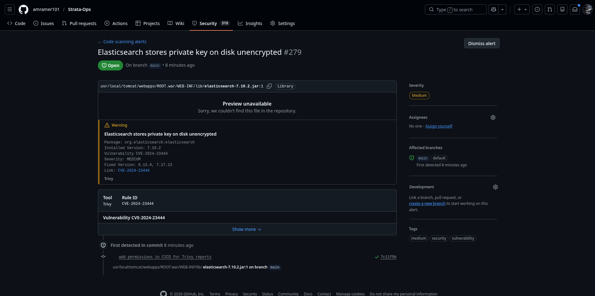
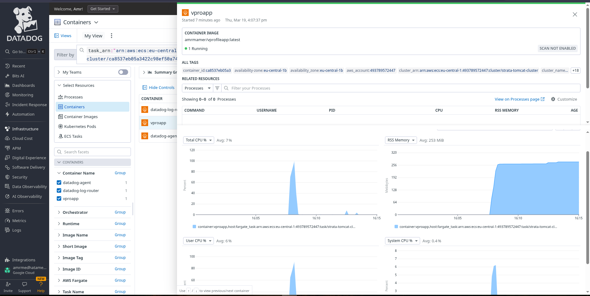
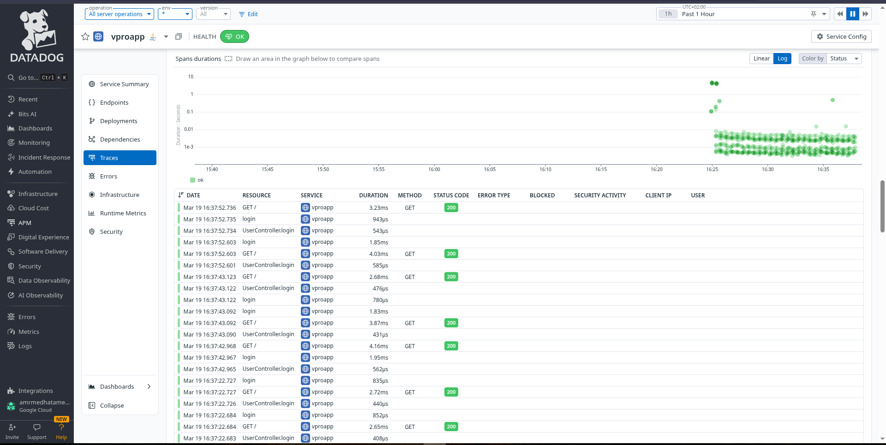
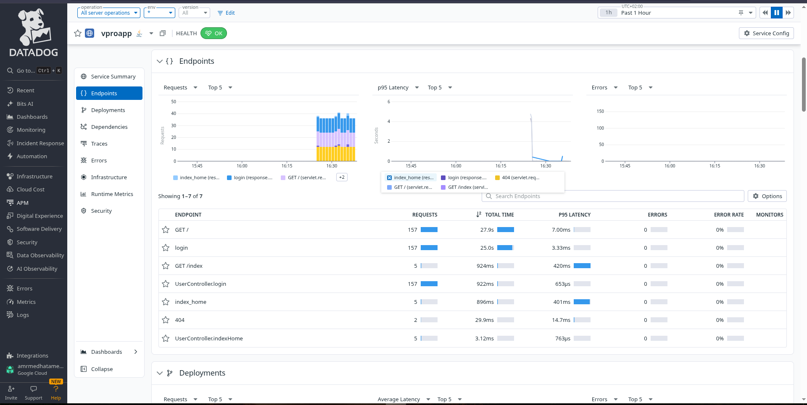
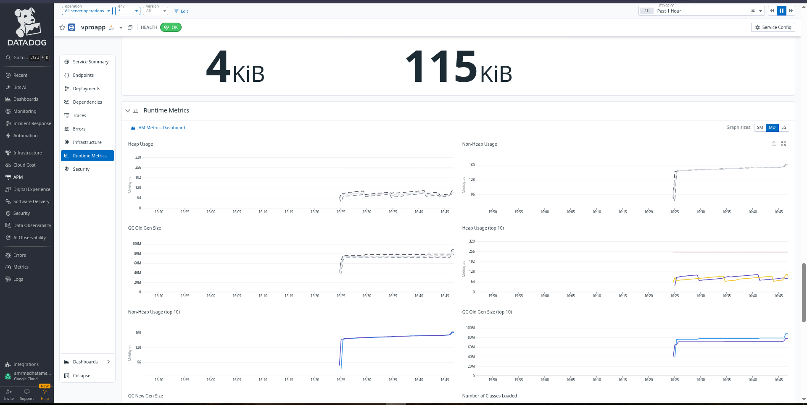

# 🐳 Phase 4.2 — Docker Cloud-Native Serverless with Datadog

> *Containerized. Serverless. Observed. Secured. — The final layer of the Strata-Ops journey.*

<div align="center">

[](https://github.com/features/actions)
[](https://www.docker.com/)
[](https://aws.amazon.com/ecs/)
[](https://www.terraform.io/)
[](https://www.datadoghq.com/)
[](https://trivy.dev/)

</div>

---

## 🎯 What Was Built

This phase transforms the 5-tier Java application into a fully **containerized, serverless, observable, and secure** cloud-native deployment on AWS ECS Fargate. Every component is automated — from a `git push` to a live production deployment — with zero manual intervention.

### The Three Pillars

```
┌─────────────────┐   ┌─────────────────┐   ┌─────────────────┐
│   🔐 SECURITY   │   │  ⚙️  AUTOMATION  │   │  📊 OBSERVABILITY│
│                 │   │                 │   │                 │
│  Trivy FS Scan  │   │ GitHub Actions  │   │ Datadog APM     │
│  Trivy Config   │   │ Docker Build    │   │ Distributed     │
│  Trivy Image    │   │ ECR Push        │   │ Tracing         │
│  CVE Reporting  │   │ ECS Deploy      │   │ JVM Metrics     │
│  GitHub GHAS    │   │ SSM Secrets     │   │ Logs Explorer   │
└─────────────────┘   └─────────────────┘   └─────────────────┘
```

---

## 🏗️ Architecture

<div align="center">


*Full cloud-native architecture — ECS Fargate, VPC, Data Layer, CI/CD Pipeline, and Datadog Observability*

</div>

<div align="center">


*Component flow diagram showing all services and their communication paths*

</div>

### Architecture Breakdown

```
┌─────────────────────────────────────────────────────────────────┐
│                     AWS eu-central-1                            │
│                                                                 │
│  ┌───────────────── VPC 10.0.0.0/16 ─────────────────────────┐ │
│  │                                                            │ │
│  │  Public Subnets          Private Subnets                  │ │
│  │  ─────────────           ─────────────────────────────    │ │
│  │  ALB :80                 ECS Fargate Task (×2)            │ │
│  │  Bastion Host            ├── Firelens (Fluent Bit)        │ │
│  │  NAT Gateway             ├── Datadog Agent                │ │
│  │                          └── vproapp (Tomcat :8080)       │ │
│  │                                                            │ │
│  │                          Data Layer                       │ │
│  │                          ├── RDS MySQL        :3306       │ │
│  │                          ├── ElastiCache       :11211     │ │
│  │                          └── AWS MQ RabbitMQ   :5671      │ │
│  └────────────────────────────────────────────────────────────┘ │
│                                                                 │
│  ECR Registry    SSM Parameter Store    CloudWatch Logs        │
└─────────────────────────────────────────────────────────────────┘
```

---

## 🔄 CI/CD Pipeline

<div align="center">


*Full pipeline execution — 8m 45s from git push to live ECS deployment*

</div>

### Pipeline Stages

```
git push → main
     │
     ▼
┌──────────────────┐
│ Get SSM Params   │  15s  ← ECR, ECS cluster, service names from Parameter Store
└────────┬─────────┘
         ▼
┌──────────────────┐
│ Trivy Code +     │  1m 11s ← Filesystem scan + Dockerfile/Terraform config scan
│ Config Scan      │
└────────┬─────────┘
         ▼
┌──────────────────┐
│ Docker Build     │  1m 44s ← Multi-stage build (Maven → Tomcat + Datadog agent)
└────────┬─────────┘
         ▼
┌──────────────────┐
│ Trivy Image Scan │  54s   ← Full image layer vulnerability scan
└────────┬─────────┘
         ▼
┌──────────────────┐
│ Push to ECR      │  45s   ← Tagged with git SHA + latest
└────────┬─────────┘
         ▼
┌──────────────────┐
│ Deploy to ECS    │  3m 26s ← Update task definition + force new deployment
└──────────────────┘
```

### Key Pipeline Design Decisions

| Decision | Reason |
|----------|--------|
| SSM for all config | Zero hardcoded values — account ID, region, cluster names pulled at runtime |
| Trivy before build | Fail fast — catch code vulnerabilities before wasting build time |
| Trivy after build | Catch OS-level CVEs in the base image layers |
| `exit-code: 0` on scans | Report vulnerabilities to GitHub Security without blocking pipeline |
| Git SHA image tag | Every deployment is traceable to an exact commit |
| `wait-for-service-stability` | Pipeline only succeeds when ECS confirms healthy tasks |

---

## 🔐 Security Scanning — Trivy + GitHub Advanced Security

<div align="center">


*310 vulnerabilities detected and reported to GitHub Security tab via SARIF format*

</div>

<div align="center">


*Full CVE traceability — package path, affected version, fixed version, and CVE ID*

</div>

### Three Scan Types

```
Scan 1: Filesystem (trivy fs .)
├── Scans pom.xml and Java dependencies
├── Detects CVEs in Maven packages
└── Reports to GitHub Security → trivy-filesystem

Scan 2: Config (trivy config .)
├── Scans Dockerfile for misconfigurations
├── Scans Terraform files for security issues
└── Reports to GitHub Security → trivy-config

Scan 3: Image (trivy image <ecr-image>)
├── Scans OS packages in the container
├── Scans all image layers
└── Reports to GitHub Security → trivy-image
```

### SARIF Integration with GitHub Advanced Security

All scan results are uploaded as SARIF (Static Analysis Results Interchange Format) to GitHub's Security tab, providing:

- **CVE ID** with direct link to NVD database
- **Exact file path** within the container (`/usr/local/tomcat/webapps/ROOT.war/WEB-INF/lib/...`)
- **Installed version** vs **fixed version** comparison
- **Severity classification** (Critical / High / Medium / Low)
- **Branch tracking** — which branches are affected

---

## 📦 Docker Architecture

### Two Dockerfiles Strategy

| File | Purpose | Used By |
|------|---------|---------|
| `Dockerfile-tomcat` | Clean build — no Datadog agent | Local testing, Docker Compose |
| `Dockerfile-with-Datadog` | Production build — includes Datadog Java APM agent | CI/CD → ECS |

### Multi-Stage Build (Dockerfile-with-Datadog)

```dockerfile
# Stage 1: Builder
FROM maven:3.9.9-eclipse-temurin-21-jammy AS builder
# Maven downloads dependencies, compiles, packages → ROOT.war

# Stage 2: Production
FROM tomcat:10-jdk21

# Pin Datadog Java agent to specific version (reproducible builds)
RUN curl -Lo dd-java-agent.jar \
    https://github.com/DataDog/dd-trace-java/releases/download/v1.36.0/dd-java-agent.jar

# Configure JVM to load agent on startup
ENV CATALINA_OPTS="-javaagent:/usr/local/tomcat/dd-java-agent.jar \
    -Ddd.service=vproapp \
    -Ddd.env=production \
    -Ddd.version=1.0"

CMD ["catalina.sh", "run"]
```

**Why `CATALINA_OPTS` and not `JAVA_OPTS`?**
Tomcat reads `CATALINA_OPTS` natively — it's guaranteed to be passed to the JVM. `JAVA_OPTS` can be silently ignored in certain Tomcat configurations.

**Why pin the agent version?**
Using `latest-java-tracer` would pull a different version on every build, making debugging impossible. Pinning `v1.36.0` ensures every build is identical and reproducible.

---

## ☁️ AWS Infrastructure (Terraform)

### Resources Created

| File | Resources | Purpose |
|------|-----------|---------|
| `vpc.tf` | VPC, 6 subnets, NAT, IGW | Network foundation |
| `ECS.tf` | Cluster, Task Definition, Service | Container orchestration |
| `ALB.tf` | Load Balancer, Target Group, Listeners | Traffic routing |
| `Data-services.tf` | RDS, ElastiCache, AWS MQ | Managed data services |
| `ECR.tf` | Container Registry | Docker image storage |
| `IAM.tf` | 3 IAM roles + policies | Permissions |
| `SSM.tf` | 8 SSM parameters | Secrets + pipeline config |
| `secgrp.tf` | 3 Security Groups | Network access control |
| `bastion.tf` | EC2 Bastion | DB initialization |

### ECS Task Definition — 3 Containers

```
ECS Fargate Task (1024 CPU / 2048 MB)
│
├── Container 1: datadog-log-router (64 CPU / 128 MB)  ← MUST BE FIRST
│   Image:  aws-for-fluent-bit:stable
│   Role:   Receives stdout logs from vproapp
│           Routes them to Datadog Cloud via HTTPS
│           Own logs → CloudWatch (backup)
│
├── Container 2: datadog-agent (256 CPU / 512 MB)
│   Image:  datadog/agent:latest
│   Role:   Collects infrastructure metrics (CPU, Memory, Network)
│           Receives APM traces via unix socket from vproapp
│           Forwards everything to Datadog Cloud
│
└── Container 3: vproapp (512 CPU / 1024 MB)  ← ESSENTIAL
    Image:  <ecr-registry>/dockertomcat_repo_staraops:<git-sha>
    Role:   The Java application
    Logs  → Firelens (awsfirelens driver)
    Traces → Datadog Agent (unix:///var/run/datadog/apm.socket)
```

**Shared Volume:** `dd-sockets` — mounted in both `vproapp` and `datadog-agent` at `/var/run/datadog`. This allows APM traces to flow via unix socket instead of network, which is faster and more reliable.

### SSM Parameter Store — Zero Hardcoded Values

```
/strata-ops/
├── mysql-password          (SecureString) ← RDS password
├── rabbitmq-password       (SecureString) ← AWS MQ password
├── datadog-api-key         (SecureString) ← Datadog API key
└── pipeline/
    ├── ecr-registry        (String) ← <account>.dkr.ecr.<region>.amazonaws.com
    ├── ecr-repo            (String) ← dockertomcat_repo_staraops
    ├── ecs-cluster         (String) ← strata-tomcat-cluster
    ├── ecs-service         (String) ← eprofile-tomcat-svc
    └── ecs-task-family     (String) ← eprofile-tomcat-task
```

The CI/CD pipeline fetches all values at runtime from SSM — no AWS account IDs, no region names, no service names are hardcoded in the workflow file.

### IAM Roles

```
ecs-task-execution-role
├── AmazonECSTaskExecutionRolePolicy (AWS managed)
└── ecs-execution-secrets-access (custom)
    ├── ssm:GetParameter on /strata-ops/*
    └── secretsmanager:GetSecretValue on /strata-ops/*

datadog-task-role
└── fargate-task-role-default-policy (custom)
    └── ecs:ListClusters
    └── ecs:ListContainerInstances
    └── ecs:DescribeContainerInstances
```

---

## 📊 Datadog Observability

### Sidecar Agent on ECS Fargate

<div align="center">


*All 3 containers visible in Datadog Infrastructure — vproapp, datadog-agent, datadog-log-router — with real-time CPU and memory metrics*

</div>

### APM — Distributed Request Tracing

<div align="center">


*Every HTTP request traced end-to-end — GET /, login, UserController.login — with sub-millisecond precision*

</div>

### APM — Endpoint Latency & Traffic Monitoring

<div align="center">


*7 endpoints tracked — 157 requests each on GET / and /login — p95 latency, error rates, and request volume*

</div>

### JVM Runtime Metrics — Heap & GC

<div align="center">


*Real-time JVM internals — Heap usage, Non-Heap usage, GC Old/New Gen sizes, Thread count, Classes loaded*

</div>

<div align="center">


*Extended JVM dashboard — GC pressure patterns, memory growth trends, thread activity*

</div>

### Observability Stack

```
vproapp (Tomcat + Datadog Java Agent)
│
├── LOGS (stdout)
│   └── Firelens (Fluent Bit)
│       └── http-intake.logs.datadoghq.com → Datadog Logs Explorer
│           (backup) → CloudWatch /ecs/vprofile-app
│
├── APM TRACES (unix socket)
│   └── Datadog Agent
│       └── APM intake → Datadog APM Services
│           ├── Distributed traces per request
│           ├── Endpoint latency (p50/p95/p99)
│           ├── Request rate and error rate
│           └── Service dependency map
│
└── JVM METRICS (via Datadog Java Agent)
    └── Datadog Agent
        └── Metrics intake → Datadog Infrastructure
            ├── Heap / Non-Heap usage
            ├── GC Old Gen / New Gen size
            ├── Thread count
            └── Classes loaded
```

---

## 🚀 Deployment Guide

### Prerequisites

```bash
# Required tools
terraform >= 1.14
aws-cli >= 2.0
docker >= 24.0
git
```

### Step 1 — Configure Terraform Variables

Create `terraform/terraform.tfvars`:

```hcl
datadog_api_key = "your-datadog-api-key"
```

> ⚠️ This file is in `.gitignore` — never commit it.

### Step 2 — Deploy Infrastructure

```bash
cd 4.2-Docker-Cloud-Native-Serverless-with-Datadog/terraform

terraform init
terraform apply --auto-approve
```

Terraform creates ~45 AWS resources in ~8 minutes.

### Step 3 — Initialize the Database

The Bastion Host runs `bastion-init.sh` automatically on first boot. It:
1. Waits for RDS to become available
2. Clones the vprofile-project repo
3. Imports `db_backup.sql` into the RDS instance
4. Verifies tables and user accounts

Monitor progress:
```bash
ssh -i docker-githubActions ubuntu@$(terraform output -raw bastion_ip)
sudo cat /var/log/cloud-init-output.log
```

### Step 4 — Configure GitHub Actions Secrets

In your GitHub repository: **Settings → Secrets → Actions**

```
AWS_ACCESS_KEY_ID      ← IAM user with deployment permissions
AWS_SECRET_ACCESS_KEY  ← IAM user secret
```

### Step 5 — Trigger the Pipeline

```bash
git add .
git commit -m "feat: initial deployment"
git push origin main
```

The pipeline triggers automatically on any change to `src/**`, `Dockerfile-with-Datadog`, or `.github/workflows/docker-image.yml`.

### Step 6 — Access the Application

```bash
terraform output alb_endpoint
# → eprofile-alb-XXXX.eu-central-1.elb.amazonaws.com
```

Open in browser: `http://<alb-endpoint>`

**Default credentials:** `admin_vp` / `admin_vp`

---

## 🔧 Key Design Decisions

### 1. Firelens Must Be the First Container
AWS requires the container with `firelensConfiguration` to be declared first in the task definition. Any container using `logDriver: awsfirelens` must come after it.

### 2. `lifecycle { ignore_changes = [task_definition] }`
The ECS service ignores task definition changes from Terraform. This is intentional — the CI/CD pipeline is the sole authority for updating the running image. Terraform manages infrastructure; GitHub Actions manages deployments.

### 3. `enable_dhcp_options = true` in VPC
AWS MQ endpoints use `.on.aws` private domains that are only resolvable within the VPC via `AmazonProvidedDNS`. Without explicit DHCP options, containers cannot resolve the RabbitMQ hostname.

### 4. `missingQueuesFatal = false` + `autoStartup = false`
RabbitMQ is used for async operations. If the Spring AMQP listener container fails to connect on startup, it would prevent Tomcat from initializing — causing ALB health checks to fail. Setting these flags lets the app start normally and degrade gracefully when RabbitMQ is unreachable.

### 5. ALB Egress Rule to Private Subnets
The ALB Security Group needs an explicit egress rule allowing traffic to `10.0.0.0/16:8080`. Without it, the ALB can receive requests on port 80 but cannot forward them to the ECS containers.

---

## 💰 Cost Estimate

| Resource | Monthly Cost |
|----------|-------------|
| ECS Fargate (2 tasks × 1vCPU/2GB) | ~$35 |
| ALB | ~$20 |
| RDS MySQL db.t3.micro | ~$15 |
| ElastiCache cache.t3.micro | ~$12 |
| AWS MQ mq.m7g.medium | ~$60 |
| NAT Gateway | ~$35 |
| ECR Storage | ~$1 |
| **Total** | **~$178/month** |

> 💡 **Cost tip:** Run `terraform destroy` when not in use. The entire stack can be recreated in under 10 minutes.

---

## 🗂️ Project Structure

```
4.2-Docker-Cloud-Native-Serverless-with-Datadog/
│
├── terraform/
│   ├── vpc.tf                  # VPC, subnets, NAT Gateway
│   ├── ECS.tf                  # Cluster, Task Definition, Service
│   ├── ALB.tf                  # Load Balancer + Target Group
│   ├── Data-services.tf        # RDS, ElastiCache, AWS MQ
│   ├── ECR.tf                  # Container Registry
│   ├── IAM.tf                  # Roles + Policies
│   ├── SSM.tf                  # Secrets + Pipeline params
│   ├── secgrp.tf               # Security Groups
│   ├── bastion.tf              # DB Init Host
│   ├── vpc.tf                  # VPC + DHCP options
│   ├── variables.tf
│   ├── output.tf
│   ├── providers.tf
│   ├── backend-state.tf        # S3 remote state
│   └── templates/
│       └── bastion-init.sh     # DB initialization script
│
├── Docker-Stack/
│   └── Dockerfile-tomcat       # Clean build (no Datadog)
│
├── .github/
│   └── workflows/
│       └── docker-image.yml    # CI/CD Pipeline
│
└── README.md                   # This file

# Root level
├── Dockerfile-with-Datadog     # Production build (with Datadog APM)
├── src/                        # Java application source
├── pom.xml                     # Maven build config
└── settings.xml
```

---

## ⬅️ Back to Main Journey

[← Phase 3: Cloud-Native PaaS](../3-AWS-Cloud-Native-with-DevSecOps/README.md) | [↑ Main README](../README.md)

---

<div align="center">

*Phase 4.2 — The final layer of the Strata-Ops journey*

**Containerized · Serverless · Observed · Secured**

</div>