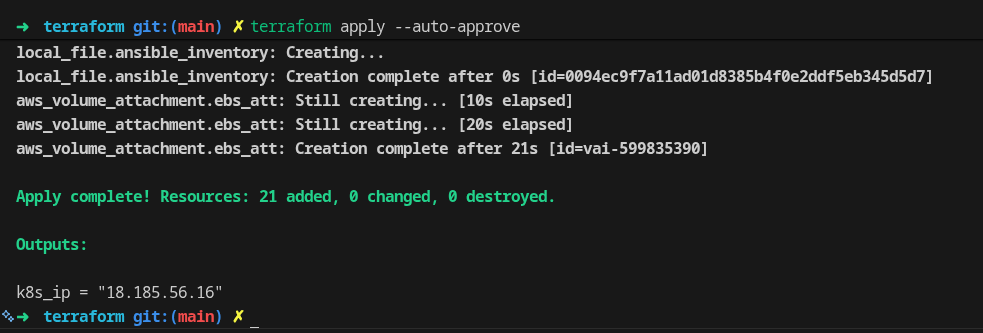
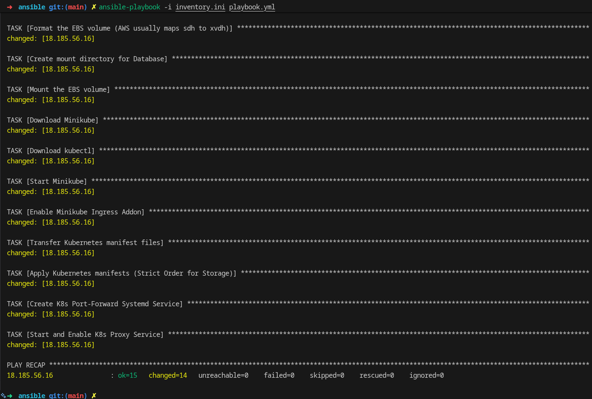
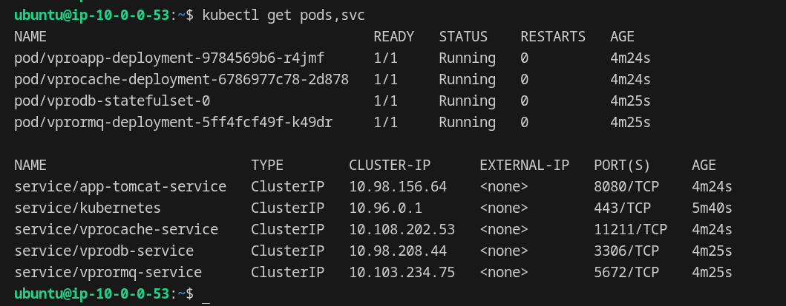
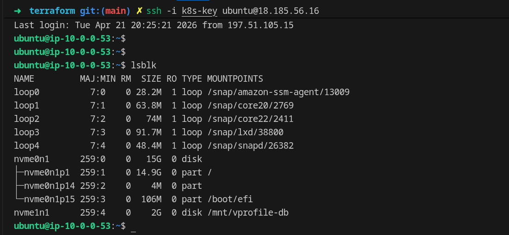
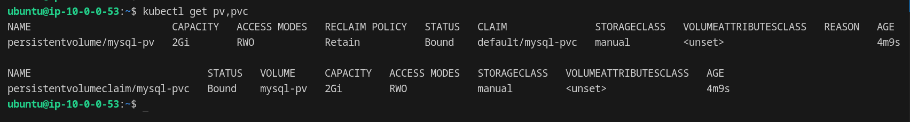
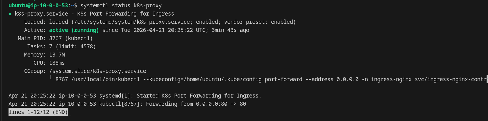

# ☸️ Phase 5 — Self-Managed Kubernetes on EC2

> *From containers to orchestration — running a real K8s workload on bare EC2 with full IaC automation.*

<div align="center">

[](https://www.terraform.io/)
[](https://www.ansible.com/)
[](https://kubernetes.io/)
[](https://aws.amazon.com/ec2/)
[](https://www.docker.com/)

</div>

---

## 🎯 What Was Built

A fully automated, end-to-end self-managed Kubernetes cluster on a single EC2 instance — provisioned by Terraform, configured by Ansible, and running a 5-tier Java application with persistent MySQL storage backed by a real EBS volume.

No EKS. No managed control plane. No shortcuts.

### The Three Pillars

```
┌─────────────────┐   ┌─────────────────┐   ┌─────────────────┐
│  ⚙️  PROVISION   │   │  🔧 CONFIGURE   │   │  ☸️  ORCHESTRATE  │
│                 │   │                 │   │                 │
│  Terraform      │   │  Ansible        │   │  Minikube       │
│  EC2 t3.medium  │   │  Docker         │   │  5 Workloads    │
│  EBS 2GiB       │   │  Minikube       │   │  Ingress NGINX  │
│  VPC + SG       │   │  kubectl        │   │  PV/PVC → EBS   │
│  S3 State       │   │  Systemd Svc    │   │  Secrets        │
└─────────────────┘   └─────────────────┘   └─────────────────┘
```

---

## 🏗️ Architecture

<div align="center">

.png)
*Full architecture — IaC layer, AWS infrastructure, Minikube cluster, and all K8s workloads with traffic and storage flows*

</div>

### Architecture Breakdown

```
┌──────────────────────────────────────────────────────────────────┐
│  IaC Layer                                                       │
│  Terraform ──── provisions ──── EC2 + EBS + VPC + SG + S3 State │
│  Ansible   ──── configures ──── Docker, Minikube, K8s manifests  │
└──────────────────────────────────────────────────────────────────┘
                              │
                              ▼
┌──────────────────────────────────────────────────────────────────┐
│  AWS  eu-central-1                                               │
│                                                                  │
│  ┌──── VPC 10.0.0.0/16 ─ Public Subnet 10.0.0.0/24 ──────────┐  │
│  │                                                            │  │
│  │  EC2: t3.medium | Ubuntu 22.04 | SG: SSH(mine) + HTTP(:80)│  │
│  │  EBS: 2GiB ext4 → mounted at /mnt/vprofile-db             │  │
│  │                                                            │  │
│  │  ┌── Minikube (--driver=docker) ─────────────────────────┐ │  │
│  │  │                                                       │ │  │
│  │  │  Ingress NGINX ← k8s-proxy.service (systemd :80)     │ │  │
│  │  │       │                                               │ │  │
│  │  │       ▼  vprofile.local.com /                        │ │  │
│  │  │  app-tomcat-service → vproapp-deployment             │ │  │
│  │  │       │                                               │ │  │
│  │  │       ├── vprodb-service   → vprodb-statefulset      │ │  │
│  │  │       │                      └─ PVC → PV → EBS       │ │  │
│  │  │       ├── vprormq-service  → vprormq-deployment      │ │  │
│  │  │       └── vprocache-service → vprocache-deployment   │ │  │
│  │  └───────────────────────────────────────────────────────┘ │  │
│  └────────────────────────────────────────────────────────────┘  │
└──────────────────────────────────────────────────────────────────┘
```

---

## 🚀 Automation Flow

### Step 1 — Terraform Provisions Everything

<div align="center">


*`terraform apply --auto-approve` — 21 resources created in one shot. The EC2, EBS volume, VPC, Security Group, Key Pair, and the Ansible `inventory.ini` are all generated automatically. The final output is the EC2 public IP ready for Ansible.*

</div>

**What Terraform builds:**

| Resource | Config |
|----------|--------|
| EC2 Instance | t3.medium, Ubuntu 22.04, 15GB gp3 root |
| EBS Volume | 2GiB, same AZ as EC2 (`eu-central-1a`) |
| VPC + Subnet | `10.0.0.0/16`, public, DNS enabled |
| Security Group | SSH from my IP only, HTTP `0.0.0.0/0:80` |
| S3 Backend | Remote state in `eu-central-1` |
| `inventory.ini` | Auto-generated with the new EC2 public IP |

The `local_file` resource in `ec2.tf` writes the dynamic IP directly into Ansible's inventory — zero manual edits between `terraform apply` and `ansible-playbook`.

---

### Step 2 — Ansible Configures the Cluster

<div align="center">


*`ansible-playbook -i inventory.ini playbook.yml` — 15 tasks, 14 changed, 0 failed. The playbook formats and mounts the EBS volume, installs Docker + Minikube + kubectl, applies all K8s manifests in strict dependency order, and registers the port-forward as a persistent systemd service. Full cluster up from zero in one run.*

</div>

**Playbook execution order (why it matters):**

```
1. Install Docker + deps          ← Minikube driver requirement
2. Add user to docker group       ←┐
3. meta: reset_connection         ←┘ group takes effect without re-login
4. Format EBS → /mnt/vprofile-db  ← persistent storage before K8s starts
5. Download Minikube + kubectl
6. minikube start --driver=docker
7. Enable Ingress addon
8. Copy K8s manifests
9. kubectl apply (strict order):  ← db/ → mq/ → cache/ → app/ → ingress/
10. Create + enable k8s-proxy.service
```

---

## ☸️ Kubernetes Workloads

<div align="center">


*`kubectl get pods,svc` — All 4 pods `Running 1/1` with 0 restarts after ~4 minutes. Every ClusterIP service is live: app-tomcat-service (:8080), vprodb-service (:3306), vprocache-service (:11211), vprormq-service (:5672). The initContainer in vproapp-deployment guaranteed the app only started after all 3 backends were reachable.*

</div>

### Kubernetes Manifest Structure

```
kubernetes/
├── db/
│   ├── db-pv.yaml          # PersistentVolume → hostPath: /mnt/vprofile-db
│   ├── db-pvc.yaml         # PersistentVolumeClaim  2Gi  storageClass: manual
│   ├── db-secrets.yaml     # database-secrets (base64, echo -n)
│   ├── mysql-statefulset.yaml
│   └── mysql-service.yaml  # vprodb-service :3306
├── mq/
│   ├── mq-secrets.yaml     # rmq-secrets
│   ├── rabbitmq-deployment.yaml
│   └── rabbitmq-service.yaml  # vprormq-service :5672
├── cache/
│   ├── memcached-deployment.yaml
│   └── memcached-service.yaml  # vprocache-service :11211
├── app/
│   ├── tomcat-deployment.yaml  # vproapp + initContainer
│   └── tomcat-service.yaml     # app-tomcat-service :8080
└── ingress/
    └── ingress.yaml         # vprofile.local.com → app-tomcat-service
```

---

## 💾 Storage — EBS → PV → PVC → MySQL

<div align="center">


*`lsblk` on the EC2 — `nvme1n1` (2G) is the EBS volume, correctly formatted and mounted at `/mnt/vprofile-db`. This is the hostPath that the Kubernetes PersistentVolume points to. The Nitro-based t3.medium exposes EBS as NVMe (`nvme1n1`), not the legacy `/dev/xvdh` name that Terraform uses during attachment.*

</div>

<div align="center">


*`kubectl get pv,pvc` — `mysql-pv` (2Gi, RWO, Retain) is `Bound` to `mysql-pvc`. The `Retain` reclaim policy means the EBS data survives even if the PVC is deleted — no accidental data loss during upgrades.*

</div>

**The full storage chain:**

```
EBS Volume (aws_ebs_volume) — attached as /dev/sdh by AWS
      │
      │  Nitro/NVMe kernel renames it to:
      ▼
/dev/nvme1n1 — formatted ext4 by Ansible
      │
      │  Ansible mounts at:
      ▼
/mnt/vprofile-db (hostPath on EC2)
      │
      │  K8s PV references:
      ▼
mysql-pv (PersistentVolume, storageClass: manual)
      │
      │  Bound to:
      ▼
mysql-pvc (PersistentVolumeClaim, 2Gi)
      │
      │  Mounted into:
      ▼
vprodb-statefulset → /var/lib/mysql
```

---

## 🌐 Ingress & Traffic Exposure

<div align="center">


*`systemctl status k8s-proxy` — the port-forward is running as a persistent systemd service (`active (running)`). The actual `kubectl port-forward` command is visible in the CGroup: binding `0.0.0.0:80` to the NGINX Ingress Controller inside the cluster. This survives reboots and auto-restarts on failure.*

</div>

**Traffic path:**

```
Browser → EC2 Public IP :80
     │
     ▼  (k8s-proxy.service)
kubectl port-forward svc/ingress-nginx-controller 80:80
     │
     ▼
NGINX Ingress Controller
     │  Host: vprofile.local.com  /
     ▼
app-tomcat-service :8080
     │
     ▼
vproapp-deployment (Tomcat + vprofileapp WAR)
```

---

## 🔧 Challenges & Solutions

Every production-grade issue encountered and solved during this phase.

---

### 1 — EBS Device Naming (Nitro NVMe)

**Problem:** Terraform attaches the EBS volume as `/dev/sdh`. Ansible was looking for `/dev/xvdh`. The EC2 t3.medium (AWS Nitro System) exposes EBS as NVMe — the OS sees `/dev/nvme1n1`. Three names, one disk, complete confusion.

**Solution:** Used `lsblk` to discover the real kernel-assigned name, then hardcoded `/dev/nvme1n1` in the Ansible playbook for both `filesystem` and `mount` tasks.

---

### 2 — Base64 Secrets with Hidden Newlines

**Problem:** MySQL was rejecting logins despite correct passwords. K8s Secrets were being corrupted because `echo "password" | base64` appends a `\n` newline character, which becomes part of the secret value inside Kubernetes.

**Solution:** Always use `echo -n`:
```bash
# ❌ Wrong — adds \n
echo "rootpassword" | base64

# ✅ Correct — clean value
echo -n "rootpassword" | base64
```

---

### 3 — Docker Group Permissions in Ansible

**Problem:** Ansible added the user to the `docker` group, then immediately tried to run `minikube start --driver=docker` — which failed because group membership only takes effect after a new login session.

**Solution:** `meta: reset_connection` forces Ansible to close and reopen the SSH connection, applying the new group membership without any manual intervention.

```yaml
- name: Add user to docker group
  user:
    name: "{{ ansible_user }}"
    groups: docker
    append: yes

- name: Reset connection to apply group changes
  meta: reset_connection   # ← the fix
```

---

### 4 — Port-Forward Persistence (Systemd Service)

**Problem:** `kubectl port-forward` dies the moment the terminal closes. Running it with `sudo` loses the `.kube/config` path. The app was unreachable after any disconnect.

**Solution:** Registered the port-forward as a Linux systemd service. It runs in the background, survives reboots, and auto-restarts on failure — managed entirely by the OS.

```ini
[Service]
ExecStart=/usr/local/bin/kubectl \
  --kubeconfig=/home/ubuntu/.kube/config \
  port-forward --address 0.0.0.0 \
  -n ingress-nginx svc/ingress-nginx-controller 80:80
Restart=always
RestartSec=5
```

---

### 5 — Race Condition: App Starting Before Backends

**Problem:** Tomcat was starting before MySQL, RabbitMQ, and Memcached were ready — crashing on first boot with connection errors.

**Solution:** `initContainers` with `netcat` to block the app until all 3 backends are reachable:

```yaml
initContainers:
  - name: wait-for-services
    image: busybox:1.28
    command: ['sh', '-c', "
      until
        nc -zvw1 vprodb-service 3306 &&
        nc -zvw1 vprormq-service 5672 &&
        nc -zvw1 vprocache-service 11211;
      do
        echo 'Waiting for backends...'; sleep 2;
      done;
    "]
```

---

### 6 — PV / PVC / StatefulSet Storage Chain

**Problem:** Understanding how to wire a physical EBS volume all the way into a running MySQL container — three abstraction layers (PV, PVC, StatefulSet volume mount) that all need to match.

**Solution:** Built the chain manually with explicit `storageClassName: manual` to prevent dynamic provisioning and ensure the hostPath PV is the only candidate:

```
PV  storageClass: manual → hostPath: /mnt/vprofile-db
PVC storageClass: manual → requests 2Gi
StatefulSet volumeMounts → claimName: mysql-pvc
```

---

### 7 — Volume Reclaim Policy

**Problem:** Default K8s behavior can delete a PV when its PVC is removed — catastrophic if triggered during an upgrade or redeploy.

**Solution:** Set `persistentVolumeReclaimPolicy: Retain` in the PV manifest. The EBS volume and its data survive independently of the K8s objects.

---

### 8 — RAM Constraints on t3.medium

**Problem:** 4GB RAM shared between Docker, Minikube control plane, and 5 application containers (Tomcat, MySQL, RabbitMQ, Memcached, NGINX). Without limits, any single container could exhaust memory and cause `OOMKilled` cascades.

**Solution:** Explicit resource requests and limits on every workload:

```yaml
resources:
  requests:
    memory: "512Mi"
    cpu: "250m"
  limits:
    memory: "1Gi"
    cpu: "500m"
```

---

### 9 — Terraform → Ansible Seamless Handoff

**Problem:** Every `terraform apply` produces a new EC2 IP. Manually updating `inventory.ini` before running Ansible is error-prone and breaks automation.

**Solution:** `local_file` resource in Terraform writes the inventory file automatically:

```hcl
resource "local_file" "ansible_inventory" {
  filename = "../ansible/inventory.ini"
  content  = <<-EOF
    [k8s_server]
    ${module.ec2_instance_k8s.public_ip} ansible_user=ubuntu ansible_ssh_private_key_file=../terraform/k8s-key
  EOF
}
```

After `terraform apply`, `inventory.ini` is ready. Run `ansible-playbook` immediately.

---

### 10 — Ansible SSH Timeout on Fresh EC2

**Problem:** Terraform completes before the EC2 instance finishes its OS initialization. Ansible connects too early and times out on SSH.

**Solution:** Add `wait_for_connection` as the first task:

```yaml
- name: Wait for SSH to become available
  wait_for_connection:
    delay: 10
    timeout: 300
```

---

### 11 — Ingress Host Header Mismatch

**Problem:** The Ingress rule is bound to `vprofile.local.com`. Hitting the EC2 public IP directly sends a different Host header — NGINX returns 404. No real DNS, so a traditional A record isn't an option.

**Solution:** The `port-forward` approach bypasses Host-based routing entirely — it creates a direct tunnel to the Ingress Controller service, which then routes correctly to the app backend regardless of the Host header used.

---

### 12 — Ansible Idempotency on EBS Format

**Problem:** Running the playbook twice on the same server would attempt to re-format the already-mounted EBS volume — destroying the database data.

**Solution:** The `filesystem` module in Ansible is idempotent by design — it checks if the device already has a filesystem before formatting. Mounting is also idempotent via the `mount` module with `state: mounted`. Running the playbook 10 times produces zero changes on an already-configured server.

---

## 🏃 Deployment Guide

### Prerequisites

```bash
terraform >= 1.9
ansible >= 2.15
aws-cli >= 2.0
# SSH key pair generated at:
# terraform/k8s-key (private) + terraform/k8s-key.pub (public)
```

### Step 1 — Generate SSH Key

```bash
cd 5-Self-Managed-Kubernetes-on-EC2/terraform
ssh-keygen -t rsa -b 4096 -f k8s-key -N ""
```

### Step 2 — Provision Infrastructure

```bash
terraform init
terraform apply --auto-approve
# inventory.ini is auto-generated with the new EC2 IP
```

### Step 3 — Configure & Deploy

```bash
cd ../ansible
ansible-playbook -i inventory.ini playbook.yml
# ~5 minutes: Docker, Minikube, all K8s manifests, systemd service
```

### Step 4 — Access the Application

```bash
# Get the EC2 IP from Terraform output
terraform -chdir=../terraform output k8s_ip

# Open in browser
http://<ec2-public-ip>
# Credentials: admin_vp / admin_vp
```

---

## 💰 Cost

| Resource | Monthly |
|----------|---------|
| EC2 t3.medium | ~$30 |
| EBS 2GiB gp2 | ~$0.20 |
| Public IP | ~$3.60 |
| S3 state | ~$0.01 |
| **Total** | **~$34/month** |

> 💡 `terraform destroy` tears down everything in under 2 minutes. The entire stack rebuilds in ~8 minutes from zero.

---

## 🗂️ Project Structure

```
5-Self-Managed-Kubernetes-on-EC2/
│
├── terraform/
│   ├── vpc.tf              # VPC, public subnet, IGW
│   ├── ec2.tf              # EC2 instance + inventory.ini generation
│   ├── ebs.tf              # EBS volume + attachment
│   ├── secgrp.tf           # Security group (dynamic IP for SSH)
│   ├── keypairs.tf         # Key pair from local public key
│   ├── variables.tf        # Region, instance type, CIDR, etc.
│   ├── output.tf           # EC2 public IP output
│   ├── providers.tf        # AWS provider v6.31.0
│   └── backend-state.tf    # S3 remote state
│
├── ansible/
│   ├── playbook.yml        # Full cluster setup (10 tasks)
│   └── inventory.ini       # Auto-generated by Terraform
│
└── kubernetes/
    ├── db/                 # PV, PVC, Secret, StatefulSet, Service
    ├── mq/                 # Secret, Deployment, Service
    ├── cache/              # Deployment, Service
    ├── app/                # Deployment (+ initContainers), Service
    └── ingress/            # NGINX Ingress rule
```

---

## ⬅️ Journey

[← Phase 4.2: Docker Cloud-Native Serverless with Datadog](../4.2-Docker-Cloud-Native-Serverless-with-Datadog/README.md) | [→ Phase 6: EKS (Coming Soon)](../6-EKS/README.md) | [↑ Main README](../README.md)

---

<div align="center">

*Phase 5 — Self-Managed Kubernetes on EC2*

**Provisioned · Automated · Orchestrated · Persistent**

*by [Amr Medhat Amer](https://github.com/amramer101) — Cloud DevSecOps*

</div>