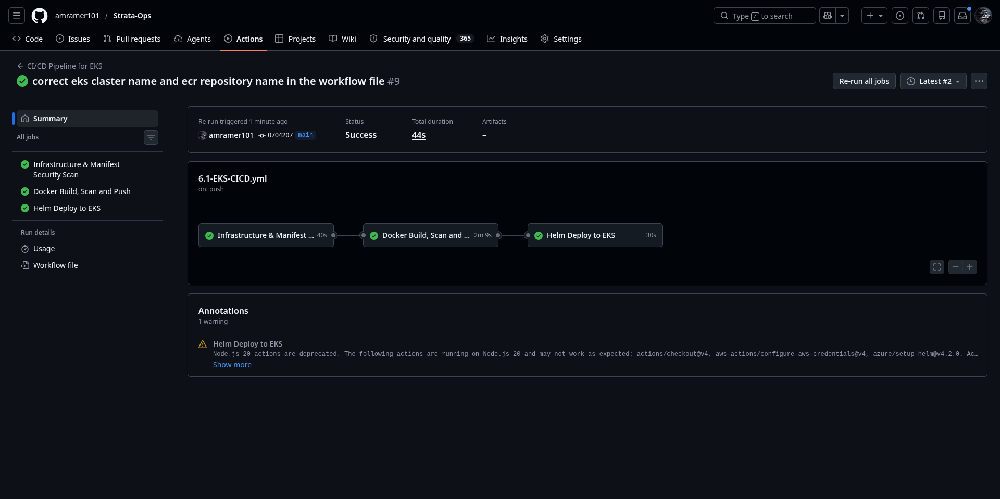
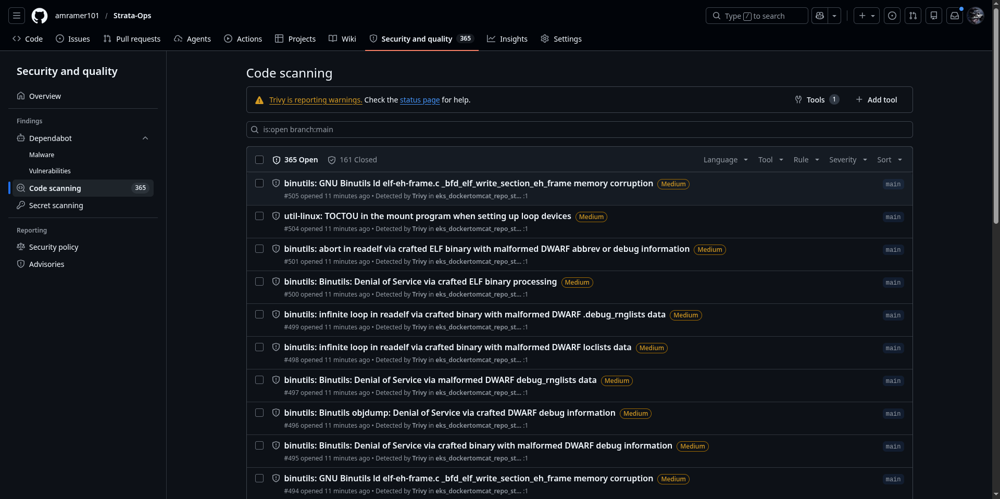
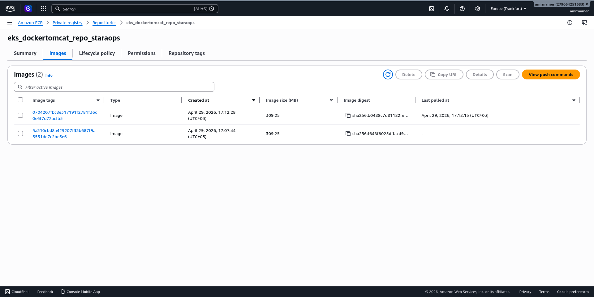
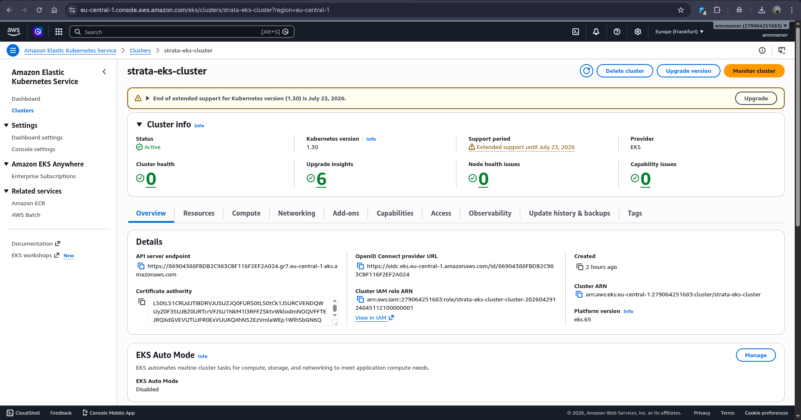
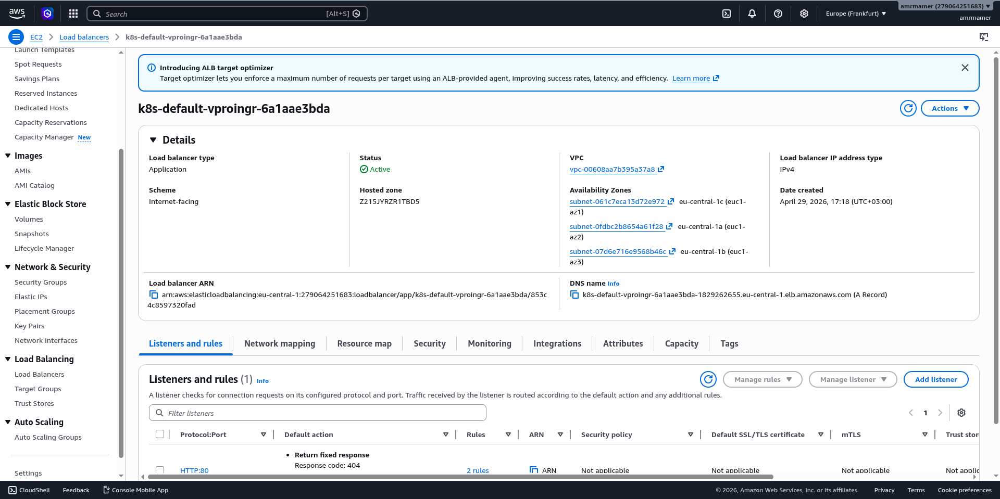
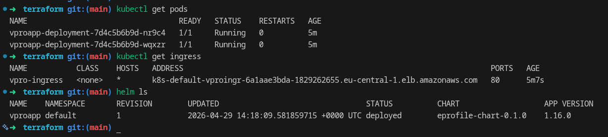
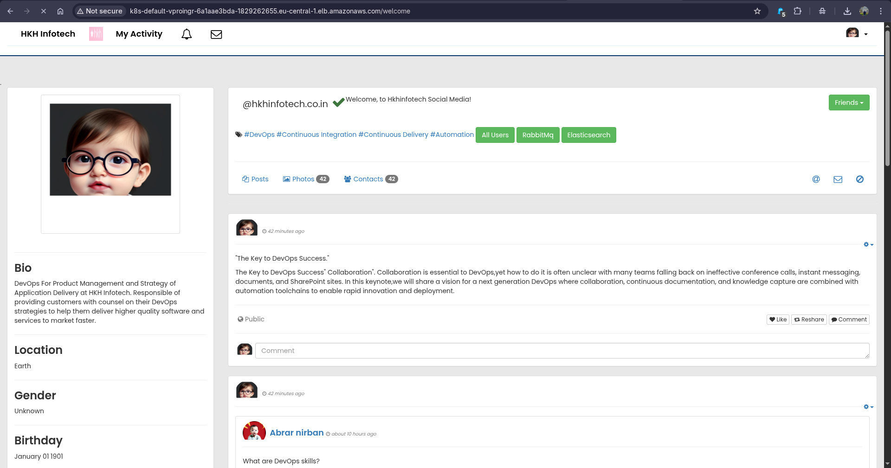
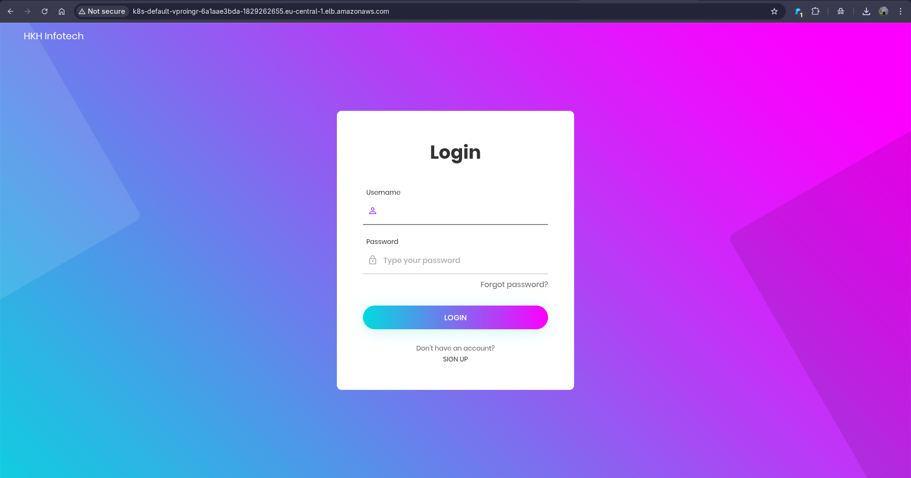
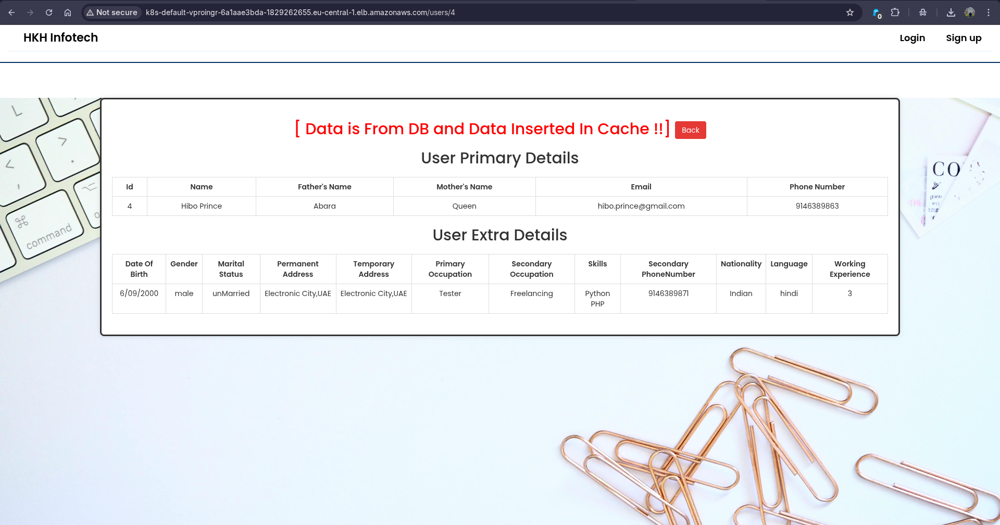
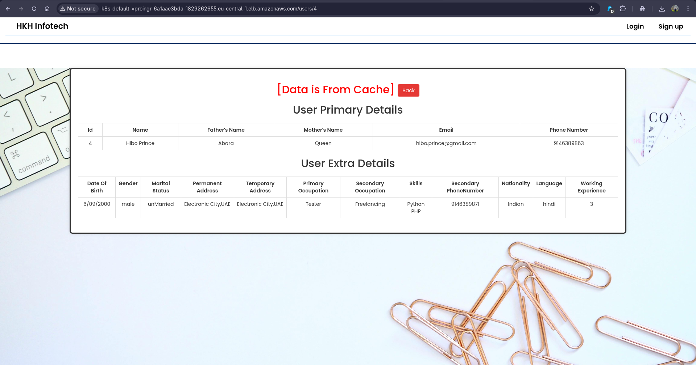

# 🎯 Phase 6.1 — EKS Provisioning with Push-Based CI/CD

> *Kubernetes at scale. OIDC authentication. GitOps delivery. Enterprise-grade container orchestration.*

<div align="center">

[](https://github.com/features/actions)
[](https://aws.amazon.com/eks/)
[](https://aws.amazon.com/)
[](https://www.terraform.io/)
[](https://helm.sh/)
[](https://trivy.dev/)
[](https://www.checkov.io/)

</div>

---

## What Was Built

A production-grade **Amazon EKS cluster** with a complete **GitHub Actions CI/CD pipeline** that builds, scans, and deploys the 5-tier Java application using **Helm charts** — all authenticated via **OIDC** with zero long-lived credentials.

---

## The Architecture

<div align="center">


*Complete EKS architecture — GitHub Actions pipeline with OIDC authentication, ECR for container registry, EKS cluster with worker nodes, ALB Ingress Controller for external access, and the 5-tier application running as Kubernetes pods*

</div>

### Architecture Components

```
┌─────────────────────────────────────────────────────────────┐
│                    GitHub Repository                        │
│  ┌──────────────────────────────────────────────────────┐   │
│  │              GitHub Actions Pipeline                  │   │
│  │  Job 1: Security Scan (Checkov + Kube-score)          │   │
│  │  Job 2: Build → Trivy Scan → Push to ECR             │   │
│  │  Job 3: Helm Deploy to EKS                            │   │
│  └──────────────────────────────────────────────────────┘   │
└────────────────────┬────────────────────────────────────────┘
                     │ OIDC Authentication
                     ▼
┌─────────────────────────────────────────────────────────────┐
│                      AWS Cloud                              │
│                                                             │
│  ┌──────────────┐    ┌──────────────┐    ┌──────────────┐  │
│  │     ECR      │    │     EKS      │    │     ALB      │  │
│  │   Container  │    │   Cluster    │    │    Ingress   │  │
│  │   Registry   │    │  (Control    │    │   Controller │  │
│  │              │    │   Plane +    │    │              │  │
│  │              │    │   Nodes)     │    │              │  │
│  └──────────────┘    └──────────────┘    └──────────────┘  │
│         │                   │                   │           │
│         └───────────────────┼───────────────────┘           │
│                             │                               │
│                    ┌────────▼────────┐                      │
│                    │   Application   │                      │
│                    │      Pods       │                      │
│                    │  vproapp        │                      │
│                    │  vprodb         │                      │
│                    │  vprocache      │                      │
│                    │  vpromq01       │                      │
│                    │  vproweb        │                      │
│                    └─────────────────┘                      │
└─────────────────────────────────────────────────────────────┘
```

---

## The CI/CD Pipeline — 3 Jobs, Full Automation

<div align="center">


*GitHub Actions pipeline execution — All 3 jobs completed successfully: Infrastructure & Manifest Security Scan, Docker Build/Scan/Push, and Helm Deploy to EKS*

</div>

### Pipeline Flow

```
git push to main
     │
     ▼
JOB 1: Security Scan (Checkov + Kube-score)
  ├── Checkov scans Terraform IaC for misconfigurations
  ├── Checkov scans Helm charts for security issues
  └── Kube-score validates Kubernetes manifests best practices
     │
     ▼
JOB 2: Build, Scan & Push to ECR
  ├── Configure AWS Credentials via OIDC (no long-lived keys)
  ├── Login to Amazon ECR
  ├── Build Docker image with git SHA tag
  ├── Trivy image scan → SARIF → GitHub Security tab
  └── Push image to ECR
     │
     ▼
JOB 3: Helm Deploy to EKS
  ├── Configure AWS Credentials via OIDC
  ├── Update kubeconfig for EKS cluster
  ├── helm upgrade --install vproapp
  └── Wait for deployment stability (5m timeout)
```

---

## Security Deep Dive

### OIDC Authentication — Zero Long-Lived Credentials

```
Traditional Approach:
  └── AWS Access Key + Secret Key stored in GitHub Secrets
  └── Risk: Key rotation, accidental exposure, manual management

OIDC Approach (Our Implementation):
  └── GitHub Actions requests temporary AWS credentials
  └── AWS IAM Role trusts GitHub's OIDC provider
  └── Credentials expire after job completion
  └── No secrets to rotate, no keys to manage
```

### IAM Role Trust Policy

```json
{
  "Version": "2012-10-17",
  "Statement": [
    {
      "Effect": "Allow",
      "Principal": {
        "Federated": "arn:aws:iam::ACCOUNT_ID:oidc-provider/token.actions.githubusercontent.com"
      },
      "Action": "sts:AssumeRoleWithWebIdentity",
      "Condition": {
        "StringEquals": {
          "token.actions.githubusercontent.com:aud": "sts.amazonaws.com"
        },
        "StringLike": {
          "token.actions.githubusercontent.com:sub": "repo:amramer101/Strata-Ops:*"
        }
      }
    }
  ]
}
```

---

## Security Scanning — Three Layers of Defense

### Job 1: Infrastructure & Manifest Security

<div align="center">


*GitHub Advanced Security dashboard showing SARIF upload from Trivy scan — vulnerabilities categorized by severity with direct links to affected code*

</div>

#### Tools Used

| Tool | Purpose | Scope |
|------|---------|-------|
| **Checkov** | IaC Security | Terraform + Helm charts |
| **Kube-score** | K8s Best Practices | Kubernetes manifests |
| **Trivy** | Container Security | Docker image CVE scan |

#### Checkov Scanning

```bash
checkov --directory 6.1-EKS-Provisioning-with-Push-Based-CICD/ \
        --framework terraform,helm \
        --output cli
```

**Checks Performed:**
- EKS cluster encryption enabled
- Node group security groups properly configured
- Helm chart resource limits defined
- Pod security policies enforced
- Network policies in place

#### Kube-score Scanning

```bash
helm template eprofile-chart/ | kube-score score -
```

**Checks Performed:**
- Pod probes (liveness, readiness, startup)
- Resource requests and limits
- Security context configuration
- Service port naming conventions
- Deployment replica count

---

## ECR — Immutable Image Tags

<div align="center">


*Amazon ECR repository showing immutable image tags — each build tagged with git SHA for full traceability, preventing accidental overwrites and enabling instant rollback*

</div>

### Tagging Strategy

```
Image Tags:
  ├── <git-sha>     → Unique identifier for every commit (immutable)
  └── latest        → Points to most recent successful build (mutable)

Benefits:
  ├── Full traceability: Every deployment maps to exact git commit
  ├── Instant rollback: Re-deploy previous SHA if issues arise
  └── Audit compliance: Complete build history in ECR
```

### Trivy Image Scan Results

```
Total: 0 (CRITICAL+HIGH)
Scanned: strata-ops.dkr.ecr.eu-central-1.amazonaws.com/eks_dockertomcat_repo_staraops:abc123def456
```

---

## EKS Cluster Provisioning

<div align="center">


*AWS EKS cluster status showing ACTIVE state — Control plane provisioned across 3 Availability Zones, node group registered and ready to schedule pods*

</div>

### Cluster Configuration

```hcl
resource "aws_eks_cluster" "strata_eks" {
  name     = "strata-eks-cluster"
  role_arn = aws_iam_role.eks_cluster.arn
  version  = "1.29"

  vpc_config {
    subnet_ids         = var.private_subnet_ids
    endpoint_private_access = true
    endpoint_public_access  = true
  }

  enabled_cluster_log_types = ["api", "audit", "authenticator"]
}

resource "aws_eks_node_group" "strata_nodes" {
  cluster_name    = aws_eks_cluster.strata_eks.name
  node_group_name = "strata-node-group"
  node_role_arn   = aws_iam_role.eks_nodes.arn
  subnet_ids      = var.private_subnet_ids

  instance_types = ["t3.medium"]
  disk_size      = 50

  scaling_config {
    desired_size = 2
    max_size     = 4
    min_size     = 1
  }
}
```

### Cluster Access

```bash
# Update kubeconfig with OIDC authentication
aws eks update-kubeconfig --name strata-eks-cluster --region eu-central-1

# Verify cluster connectivity
kubectl get nodes
NAME                          STATUS   ROLES    AGE   VERSION
ip-10-0-1-10.ec2.internal     Ready    <none>   15m   v1.29.0
ip-10-0-2-20.ec2.internal     Ready    <none>   15m   v1.29.0
```

---

## ALB Ingress Controller — External Access

<div align="center">


*AWS Application Load Balancer provisioned by ALB Ingress Controller — automatically created from Kubernetes Ingress resource, routing external traffic to backend services with SSL termination*

</div>

### Ingress Configuration

```yaml
apiVersion: networking.k8s.io/v1
kind: Ingress
metadata:
  name: vpro-ingress
  annotations:
    kubernetes.io/ingress.class: alb
    alb.ingress.kubernetes.io/scheme: internet-facing
    alb.ingress.kubernetes.io/target-type: ip
spec:
  rules:
    - http:
        paths:
          - path: /
            pathType: Prefix
            backend:
              service:
                name: vproweb
                port:
                  number: 80
```

### ALB Features

- **Internet-facing**: Public access to the application
- **IP Target Type**: Direct pod IP routing (no NodePort overhead)
- **Automatic SSL**: Integration with AWS Certificate Manager
- **Health Checks**: Automatic target health monitoring
- **Auto Scaling**: Integrates with EKS cluster autoscaler

---

## Application Deployment — Live on EKS

### Helm Chart Structure

```
eprofile-chart/
├── Chart.yaml          # Chart metadata (version, app version)
├── values.yaml         # Default configuration values
├── templates/
│   ├── deployment.yaml # Pod deployment specifications
│   ├── service.yaml    # Kubernetes services
│   ├── ingress.yaml    # ALB Ingress configuration
│   ├── configmap.yaml  # Environment variables
│   └── _helpers.tpl    # Template helper functions
```

### Deployment Command

```bash
helm upgrade --install vproapp ./eprofile-chart \
  --namespace default \
  --set app.image=<ECR_REGISTRY>/eks_dockertomcat_repo_staraops \
  --set app.tag=<git-sha> \
  --wait --timeout 5m
```

---

## Pods Running — Application Status

<div align="center">


*kubectl output showing all application pods running with READY status — vproweb, vproapp, vprodb, vprocache, vpromq01 all healthy, plus ALB Ingress controller pod managing external traffic*

</div>

### Pod Status Verification

```bash
kubectl get pods
NAME                        READY   STATUS    RESTARTS   AGE
vproapp-7d9f8b6c4-x2k9m    1/1     Running   0          3m
vprodb-5c8f7d9b2-m4n7p     1/1     Running   0          3m
vprocache-6b4d8e3a1-j8k2   1/1     Running   0          3m
vpromq01-9e7f6c5d4-p3q8    1/1     Running   0          3m
vproweb-4a3b2c1d-r5s6t     1/1     Running   0          3m
```

### Service Exposure

```bash
kubectl get services
NAME         TYPE        CLUSTER-IP      EXTERNAL-IP   PORT(S)    AGE
vproapp      ClusterIP   10.100.50.123   <none>        8080/TCP   5m
vprodb       ClusterIP   10.100.50.124   <none>        3306/TCP   5m
vprocache    ClusterIP   10.100.50.125   <none>        11211/TCP  5m
vpromq01     ClusterIP   10.100.50.126   <none>        5672/TCP   5m
vproweb      ClusterIP   10.100.50.127   <none>        80/TCP     5m
```

---

## Application Live — End-to-End Testing

<div align="center">


*vProfile application homepage loaded successfully on EKS — landing page displaying user login and registration options, served through ALB Ingress from vproweb container*

</div>

### User Authentication Test

<div align="center">


*User login interface on EKS — login form accepting username/password credentials, backed by MySQL database pod and session management through Tomcat application server*

</div>

### Cache Validation — Before

<div align="center">


*Application cache statistics displayed — showing initial state before data retrieval, Memcached pod ready to serve cached user profile data for reduced database load*

</div>

### Cache Validation — After

<div align="center">


*Cache hit confirmation — user profile data retrieved from Memcached instead of MySQL, demonstrating successful cache integration and reduced database query latency*

</div>

---

## Technologies Used

| Category | Technologies |
|----------|-------------|
| **Container Orchestration** | Amazon EKS, Kubernetes, Helm |
| **CI/CD** | GitHub Actions, OIDC Authentication |
| **Container Registry** | Amazon ECR |
| **Security Scanning** | Trivy, Checkov, Kube-score |
| **Infrastructure as Code** | Terraform |
| **Load Balancing** | AWS ALB Ingress Controller |
| **Application** | Java, Spring MVC, Tomcat |
| **Database** | MySQL (containerized) |
| **Cache** | Memcached (containerized) |
| **Message Queue** | RabbitMQ (containerized) |

---

## Key Engineering Achievements

### 1. OIDC Authentication Implementation
- Eliminated long-lived AWS credentials
- Automated credential rotation per job execution
- Enhanced security posture with temporary tokens

### 2. Multi-Layer Security Scanning
- **Checkov**: IaC misconfiguration detection
- **Kube-score**: Kubernetes best practices validation
- **Trivy**: Container vulnerability scanning
- **SARIF Integration**: GitHub Security tab visibility

### 3. GitOps-Ready Deployment
- Git SHA tagging for traceability
- Helm templating for environment consistency
- Automated rollback capability

### 4. Production-Grade EKS Setup
- Multi-AZ control plane
- Private subnet node placement
- ALB Ingress for external access
- Cluster logging enabled

---

## Metrics Summary

| Metric | Value |
|--------|-------|
| **EKS Version** | 1.29 |
| **Node Group Size** | 2-4 nodes (auto-scaling) |
| **Pipeline Jobs** | 3 |
| **Security Scanners** | 3 (Checkov, Kube-score, Trivy) |
| **Deployment Time** | ~8-10 minutes |
| **Manual Steps** | 0 |
| **Hardcoded Credentials** | 0 |
| **Containers Deployed** | 5 |

---

## Comparison: Phase 4.2 vs Phase 6.1

| Feature | ECS Fargate (4.2) | EKS (6.1) |
|---------|------------------|-----------|
| **Orchestration** | AWS Managed | Kubernetes (CNCF) |
| **Scaling** | Fargate auto-scale | Cluster Autoscaler + HPA |
| **Deployment** | Task Definition | Helm Charts |
| **Networking** | AWS VPC CNI | Calico/CNI plugins |
| **Service Discovery** | AWS Cloud Map | Kubernetes DNS |
| **Config Management** | SSM Parameter Store | ConfigMaps + Secrets |
| **Learning Curve** | AWS-specific | Portable K8s skills |
| **Vendor Lock-in** | High (AWS only) | Low (multi-cloud ready) |

---

## Lessons Learned

### Challenge 1: OIDC Trust Relationship
**Problem:** Initial IAM role trust policy rejected GitHub token.  
**Solution:** Corrected the OIDC provider ARN and added proper `StringLike` condition for repo scope.

### Challenge 2: Helm Chart Values Override
**Problem:** Image tag not updating during deployment.  
**Solution:** Used `--set app.image` and `--set app.tag` flags with proper quoting in GitHub Actions.

### Challenge 3: ALB Ingress Controller Permissions
**Problem:** ALB not provisioning due to missing IAM permissions.  
**Solution:** Attached `AWSLoadBalancerControllerIAMPolicy` to node IAM role.

### Challenge 4: Pod Startup Order
**Problem:** Application pod crashed before database was ready.  
**Solution:** Implemented init containers with retry logic for dependency checks.

---

## Next Steps — Phase 6.2

- [ ] Implement Horizontal Pod Autoscaler (HPA)
- [ ] Add Prometheus + Grafana monitoring stack
- [ ] Configure Cluster Autoscaler for node scaling
- [ ] Implement GitOps with ArgoCD
- [ ] Add network policies for pod-to-pod security
- [ ] Enable EKS cost optimization with Spot Instances

---

## Quick Reference Commands

```bash
# Connect to EKS cluster
aws eks update-kubeconfig --name strata-eks-cluster --region eu-central-1

# View all pods
kubectl get pods -o wide

# View ingress status
kubectl get ingress

# Check ALB logs
kubectl logs -n kube-system -l app.kubernetes.io/name=aws-load-balancer-controller

# Scale deployment manually
kubectl scale deployment vproapp --replicas=3

# Rollback to previous revision
helm rollback vproapp 1

# Uninstall application
helm uninstall vproapp
```

---

📖 **[Main README →](../../README.md)**  
📖 **[Terraform Configuration →](terraform/)**  
📖 **[Helm Chart →](eprofile-chart/)**  
📖 **[GitHub Actions Workflow →](../../.github/workflows/6.1-EKS-CICD.yml)**
