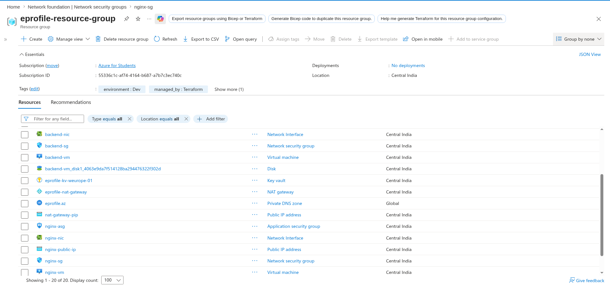
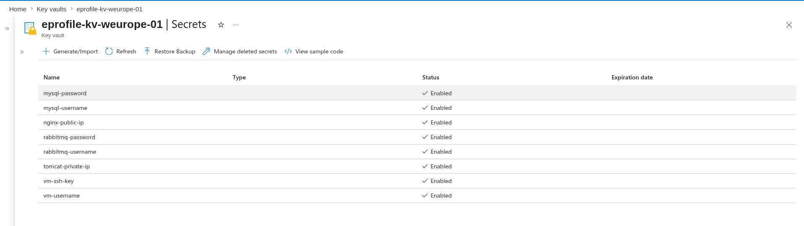
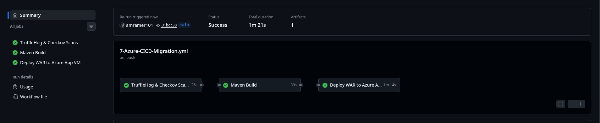
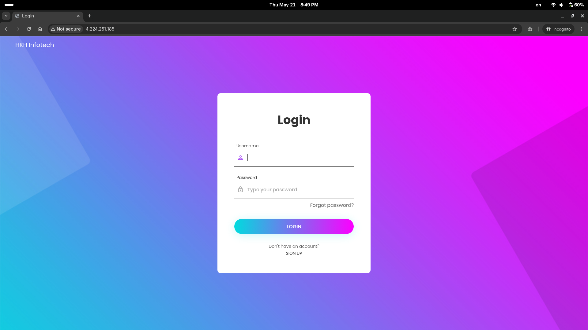
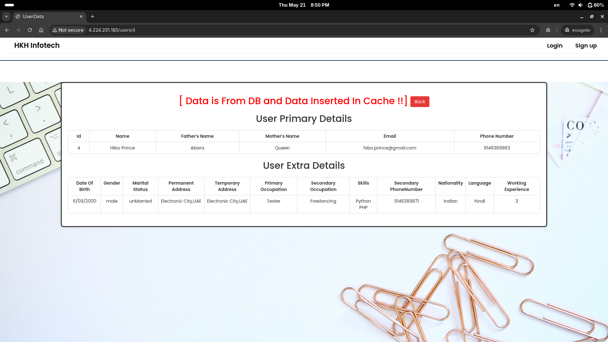
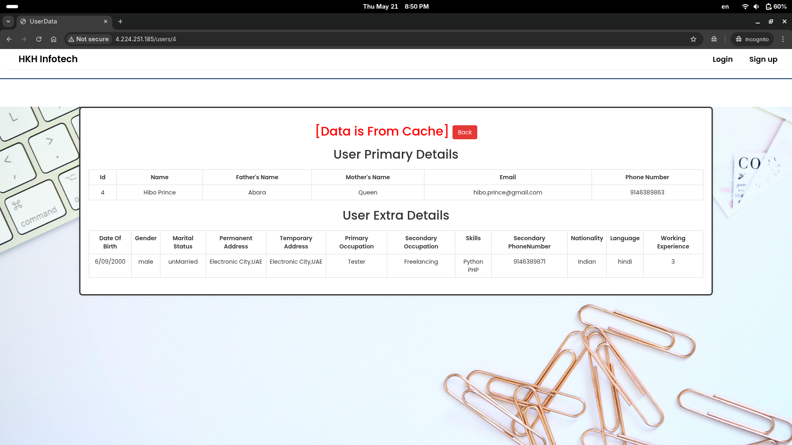
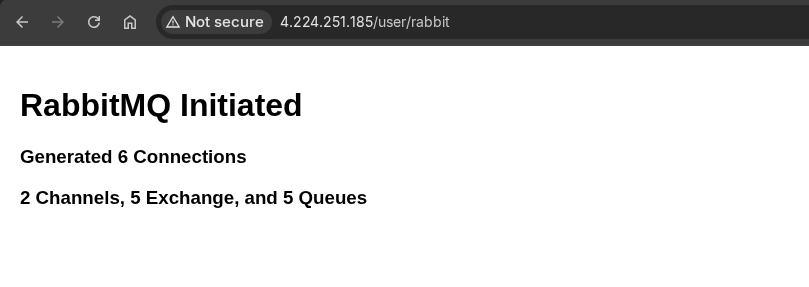

# Phase 7 — Azure Lift & Shift with CI/CD Migration

This phase migrates the eProfile application from its AWS EC2 foundation (Phase 2) to Microsoft Azure. The same 3-tier production topology is preserved: an Nginx reverse proxy in a public subnet, a Tomcat application server in a private subnet, and a backend VM running MariaDB, Memcached, and RabbitMQ in a deeper private subnet. Every component — networking, identity, secrets, and deployment — is re-implemented using native Azure services provisioned entirely by Terraform.

---

## Architecture

```
                          Internet
                              |
               ┌──────────────────────────────┐
               │  Azure VNet  10.0.0.0/16     │
               │                              │
               │  ┌─ nginx-subnet-public ───┐ │
               │  │  nginx-vm               │ │◄── Static Public IP
               │  │  Nginx reverse proxy    │ │
               │  │  Bastion Host           │ │
               │  └────────────┬────────────┘ │
               │               │ :8080        │
               │  ┌─ application-subnet ────┐ │
               │  │  app-vm                 │ │
               │  │  Tomcat 10 + Java 21    │ │
               │  │  Managed Identity       │ │
               │  └────────────┬────────────┘ │
               │               │ :3306/:11211/:5672
               │  ┌─ backend-subnet ────────┐ │
               │  │  backend-vm             │ │
               │  │  MariaDB   Memcached    │ │
               │  │  RabbitMQ  Managed ID   │ │
               │  └─────────────────────────┘ │
               │                              │
               │  NAT Gateway ──► Internet    │
               └──────────────────────────────┘
                        │                │
              Azure Key Vault     Private DNS Zone
              eprofile-kv-*         eprofile.az
```

Internal service discovery is handled by an Azure Private DNS Zone (`eprofile.az`) with auto-registered A records for each VM. Private VMs reach the internet exclusively through the NAT Gateway — they carry no public IPs.

---

## AWS to Azure Migration Map

| Layer | AWS — Phase 2 | Azure — Phase 7 | Notes |
|---|---|---|---|
| Compute | EC2 Ubuntu 22.04 | Azure Linux VM Ubuntu 22.04 | Same OS, same userdata pattern |
| Networking | VPC + Subnets + IGW | VNet + Subnets + NAT Gateway | NAT Gateway replaces per-VM public IPs for private subnets |
| Traffic Rules | Security Groups (per instance) | NSGs + Application Security Groups | ASGs enable source-group rules without hardcoding IP ranges |
| Internal DNS | Route53 Private Hosted Zone (`eprofile.in`) | Azure Private DNS Zone (`eprofile.az`) | Same A record pattern; auto-registration enabled on VNet link |
| Secrets | AWS SSM Parameter Store | Azure Key Vault | Managed Identity replaces IAM Instance Profiles |
| VM Identity | IAM Role + Instance Profile | System-Assigned Managed Identity | Zero long-lived credentials on any VM |
| IaC State Backend | S3 Bucket | Azure Blob Storage (`azurerm` backend) | `terraform-rg` / `terraformstateeprofile` / `tfstate` container |
| CI/CD Engine | Jenkins on self-hosted EC2 | GitHub Actions (hosted runners) | Pipeline defined in `.github/workflows/7-Azure-CICD-Migration.yml` |
| Secret injection (pipeline) | SSM `get-parameter` in Jenkinsfile | `azure/get-keyvault-secrets` Action | Fetched at runtime per job, never stored as GitHub Secrets |
| Deployment target | Direct SSH from Jenkins EC2 | SCP + SSH via Nginx Bastion proxy | Hosted runners are public; private VM requires a proxy hop |

---

## Infrastructure

### Virtual Network Design

| Subnet | CIDR | Resources |
|---|---|---|
| `nginx-subnet-public` | `10.0.0.0/24` | nginx-vm + NSG + static public IP |
| `application-subnet-private` | `10.0.1.0/24` | app-vm + NSG + NAT Gateway association |
| `backend-subnet-private` | `10.0.2.0/24` | backend-vm + NSG + NAT Gateway association |

### Security Groups and Traffic Rules

| NSG | Inbound Rules |
|---|---|
| `nginx-sg` | SSH from deployer IP, HTTP :80 from anywhere |
| `app-sg` | SSH from deployer IP, :8080 from `nginx-asg` (Application Security Group) |
| `backend-sg` | SSH from deployer IP, :3306/:11211/:5672 from `app-asg` |

Application Security Groups are used as traffic sources instead of IP ranges. This means the rule `allow :8080 from nginx-asg` automatically tracks membership — no manual IP updates required when VMs are replaced.

### Azure Key Vault Secrets

All secrets are generated and written to Key Vault by Terraform at `apply` time. No secret is hardcoded in any script, variable file, or repository.

| Secret Name | Value Source | Purpose |
|---|---|---|
| `mysql-username` | Terraform variable | MariaDB admin username |
| `mysql-password` | `random_password` (8 chars) | MariaDB admin password |
| `rabbitmq-username` | Terraform variable | RabbitMQ admin username |
| `rabbitmq-password` | `random_password` (16 chars) | RabbitMQ admin password |
| `tomcat-private-ip` | `app_nic.private_ip_address` | App VM private IP for CI/CD pipeline |
| `nginx-public-ip` | `nginx_pip.ip_address` | Nginx public IP for CI/CD bastion |
| `vm-username` | Terraform variable | SSH username used by pipeline |
| `vm-ssh-key` | Local key file | SSH private key for GitHub Actions deployment |

### Managed Identity Access

Both `app-vm` and `backend-vm` are assigned System-Assigned Managed Identities. Terraform grants each identity a `Get`/`List` access policy on the Key Vault. During provisioning, each VM's userdata script calls the Azure IMDS endpoint to obtain a short-lived bearer token, then retrieves the specific secrets it needs directly from the Key Vault REST API.

---

## CI/CD Pipeline

The GitHub Actions pipeline runs on every push to `main` that touches application source, userdata scripts, or the workflow file itself.

```
┌─────────────────────────────┐
│  TruffleHog & Checkov Scans │  26s
│  Secret scan + IaC scan     │
└──────────────┬──────────────┘
               │
┌──────────────▼──────────────┐
│  Maven Build                │  39s
│  JDK 21 + artifact upload   │
└──────────────┬──────────────┘
               │
┌──────────────▼──────────────┐
│  Deploy WAR to Azure App VM │  1m 14s
│  KV fetch → SCP → SSH       │
└─────────────────────────────┘

Total:  1m 21s
```

### Job 1 — Security Scans

- **TruffleHog** scans the full commit history (`fetch-depth: 0`) for verified leaked credentials. The pipeline aborts if any verified secret is detected.
- **Checkov** performs IaC security analysis on all Terraform files (`soft_fail: false`). Any HIGH-severity finding blocks the pipeline before a single line of application code is built.

### Job 2 — Maven Build

- Runs on JDK 21 with Maven dependency caching.
- Packages the application as a WAR artifact and uploads it for the deploy job.

### Job 3 — Deploy

- Authenticates to Azure using a Service Principal stored as a single `AZURE_CREDENTIALS` GitHub Secret.
- Fetches `tomcat-private-ip`, `nginx-public-ip`, `vm-username`, and `vm-ssh-key` from Key Vault at runtime using the `azure/get-keyvault-secrets` action.
- Copies the WAR to `app-vm` via SCP, using `nginx-vm` as an SSH proxy host.
- SSHs into `app-vm` (again via the nginx proxy), stops Tomcat, swaps the WAR, and restarts the service.

---

## Challenges and Solutions

### 1. mDNS Conflict with the `.az` Domain

**Problem:** Ubuntu's `systemd-resolved` intercepted DNS queries for `backend.eprofile.az` and attempted to resolve them via Multicast DNS rather than forwarding them to Azure's internal resolver. This produced `Temporary failure in name resolution` despite the Private DNS Zone and A records being correctly provisioned.

**Solution:** `MulticastDNS` was explicitly disabled in `/etc/systemd/resolved.conf`. All DNS queries — including `.az` domains — were then forwarded to Azure's internal resolver at `168.63.129.16`, which correctly handled Private DNS Zone lookups.

---

### 2. Race Condition During VM Provisioning

**Problem:** Terraform provisions VMs in parallel. The `app-vm` userdata script would begin executing and attempt to connect to MariaDB before the `backend-vm` had finished installing and initialising the database. This caused Tomcat to fail at startup with a `Communications link failure`.

**Solution:** A `netcat` wait loop was added to the `app-vm` userdata script:

```bash
while ! nc -zv backend.eprofile.az 3306; do
  echo "Database not ready. Sleeping 10s..."
  sleep 10
done
```

Tomcat environment variables are only written and the service only started after port 3306 becomes reachable. A `depends_on` block in `compute.tf` additionally ensures `app-vm` is created after `backend-vm`, giving the backend a provisioning head start.

---

### 3. Environment Variables Not Propagating to the JVM

**Problem:** Credentials fetched from Key Vault were exported as shell environment variables inside `setenv.sh`. When Tomcat ran as a `systemd` service under the `tomcat` user, these exported variables were not inherited by the JVM process. The Spring application read null values for `RDS_HOSTNAME`, `RDS_PASSWORD`, and related properties.

**Solution:** Variables were converted to Java System Properties by injecting them through `CATALINA_OPTS` inside `setenv.sh`:

```bash
export CATALINA_OPTS="-DRDS_HOSTNAME=backend.eprofile.az \
  -DRDS_PORT=3306 -DRDS_DB_NAME=accounts \
  -DRDS_USERNAME=$DB_USER -DRDS_PASSWORD=$DB_PASS \
  -DRABBITMQ_HOSTNAME=backend.eprofile.az \
  -DRABBITMQ_USER=$RMQ_USER -DRABBITMQ_PASS=$RMQ_PASS \
  -DMEMCACHED_HOSTNAME=backend.eprofile.az"
```

Spring's `application.properties` references these as `${RDS_HOSTNAME}`, which correctly resolves Java System Properties set via `-D` flags regardless of the process launch method.

---

### 4. GitHub Actions Cannot Reach the Private Application VM

**Problem:** GitHub-hosted runners are public-internet machines with no network path into the Azure private subnet where `app-vm` resides. Direct SCP and SSH connections to the private IP timed out.

**Solution:** The `nginx-vm` (static public IP, public subnet) was used as an SSH ProxyJump host in both the SCP and SSH pipeline steps. The relevant secrets are fetched from Key Vault immediately before each step:

```yaml
host:           ${{ steps.kv.outputs.tomcat-private-ip }}
proxy_host:     ${{ steps.kv.outputs.nginx-public-ip }}
proxy_username: ${{ steps.kv.outputs.vm-username }}
proxy_key:      ${{ steps.kv.outputs.vm-ssh-key }}
```

The runner connects to Nginx on the public IP, which transparently tunnels the connection to `app-vm`. No VPN, no Azure Bastion service, and no additional infrastructure were required.

---

### 5. Zero-Credential Secret Management Across Three Contexts

**Problem:** The same credentials needed to be available during VM provisioning, at application runtime inside Tomcat, and during the GitHub Actions deployment pipeline — without storing any secret in code, in plaintext Terraform state, or as a permanent environment variable.

**Solution:** A three-layer approach was applied across all contexts:

- **Terraform** generates all passwords using `random_password` and writes them directly to Key Vault at `apply` time. They never appear in userdata scripts or `.tfvars` files.
- **VMs at boot** authenticate using their System-Assigned Managed Identity via the IMDS endpoint. The userdata script exchanges the identity token for a short-lived Key Vault bearer token and fetches only the secrets it needs. No credentials are written to disk.
- **GitHub Actions pipeline** authenticates to Azure via a single `AZURE_CREDENTIALS` Service Principal secret, then uses the official `azure/get-keyvault-secrets` action to retrieve only the four secrets needed for that specific deployment job. Secrets are scoped to the job and discarded after it completes.

---

## Verification

### Azure Resource Group

All 20 infrastructure resources provisioned by Terraform inside `eprofile-resource-group`, including VMs, NICs, NSGs, ASGs, Key Vault, NAT Gateway, Private DNS Zone, and public IPs — tagged `environment: Dev` and `managed_by: Terraform`.



---

### Azure Key Vault Secrets

Eight secrets auto-generated and stored in `eprofile-kv-weurope-01` during `terraform apply`. All secrets show `Enabled` status with no expiration date and no manual intervention required.



---

### GitHub Actions Pipeline — Successful Run

All three jobs passed in 1 minute 21 seconds: TruffleHog & Checkov security scan, Maven build, and WAR deployment to the Azure app VM via the Nginx bastion proxy.



---

### Application Connectivity

The eProfile login page served over HTTP through the Nginx reverse proxy on the public IP. This confirms the full Nginx → Tomcat → Backend chain is operational.



---

### Database Verification — First Request

On the first request for user data, the application queries MariaDB directly and writes the result to Memcached. The page header confirms the data source as the database.



---

### Cache Verification — Subsequent Request

On the second request for the same user, the application reads from Memcached rather than the database. The page header confirms the cache layer is serving the response correctly.



---

### RabbitMQ Verification

Hitting the `/user/rabbit` endpoint confirms RabbitMQ is running and fully initialised — 6 connections established, 2 channels, 5 exchanges, and 5 queues created.



---

## Technology Stack

| Category | Technology |
|---|---|
| Cloud | Microsoft Azure |
| Compute | Azure Linux VM (Ubuntu 22.04) |
| Networking | VNet, NSG, Application Security Groups, NAT Gateway |
| DNS | Azure Private DNS Zone |
| Secrets | Azure Key Vault, System-Assigned Managed Identity |
| IaC | Terraform (azurerm provider 3.116.0, remote state on Azure Blob) |
| CI/CD | GitHub Actions |
| Security scanning | TruffleHog (secrets), Checkov (IaC) |
| Application | Tomcat 10, Java 21, Spring MVC, MariaDB, Memcached, RabbitMQ, Nginx |