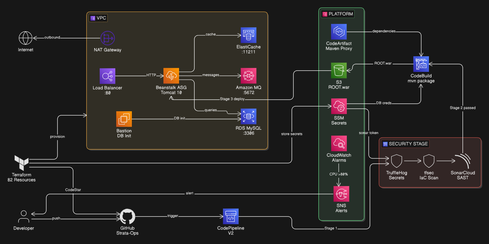
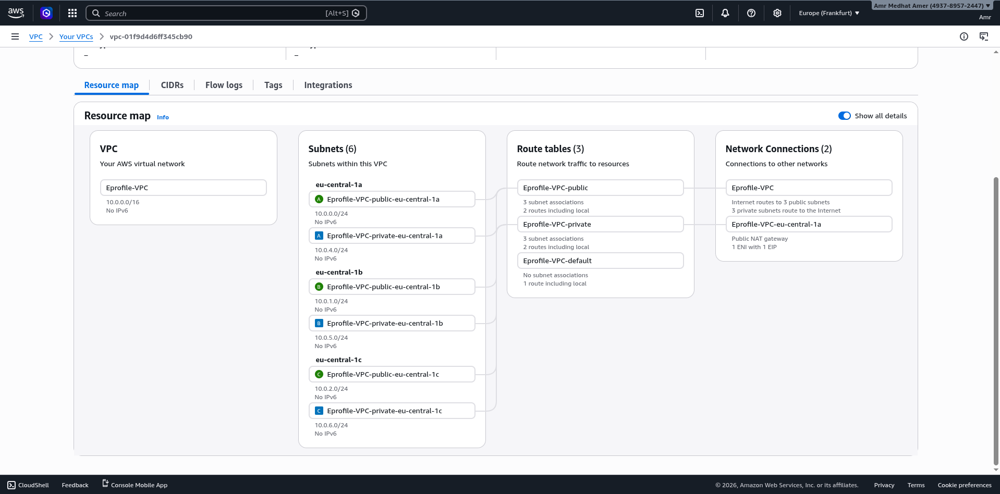

# 🌋 Strata-Ops — From Cloud-Native EKS to the First Line of Code

<div align="center">

[](https://opensource.org/licenses/MIT)
[](https://github.com/amramer101/Strata-Ops)
[](https://www.terraform.io/)
[](https://kubernetes.io/)
[](https://aws.amazon.com/)
[](https://owasp.org/)
[](https://github.com/features/actions)
[](https://helm.sh/)
[](https://www.docker.com/)

</div>

---

> **Strata-Ops** is a complete, production-grade DevSecOps engineering journey — documenting the full transformation of a 5-tier Java application from a local Vagrant setup into a hardened, auto-scaling Kubernetes platform on AWS EKS, with GitOps delivery, OIDC authentication, multi-layer security scanning, and zero manual steps.
>
> Like the geological layers of the Earth, each phase builds on the previous one. This README reads **top-down** — starting from the most advanced production system and descending through every architectural layer to the original foundation.

---

## 📑 Table of Contents

1. [What is Strata-Ops?](#-what-is-strata-ops)
2. [The Application — VProfile](#-the-application--vprofile)
3. [The Geological Model — Phase Overview](#-the-geological-model--phase-overview)
4. [DevSecOps at Every Layer](#-devsecops-at-every-layer)
5. [Phase 6.1 — Production EKS + GitOps + OIDC](#-phase-61--production-eks--gitops--oidc)
6. [Phase 5.2 — Helm Packaging & Templating](#-phase-52--helm-packaging--templating)
7. [Phase 5.1 — Self-Managed Kubernetes on EC2](#-phase-51--self-managed-kubernetes-on-ec2)
8. [Phase 4.2 — ECS Fargate + Datadog APM](#-phase-42--ecs-fargate--datadog-apm)
9. [Phase 4.1 — Docker Compose + Ansible](#-phase-41--docker-compose--ansible)
10. [Phase 3 — AWS Cloud-Native PaaS + DevSecOps](#-phase-3--aws-cloud-native-paas--devsecops)
11. [Phase 2 — AWS Lift & Shift + CI/CD + Monitoring](#-phase-2--aws-lift--shift--cicd--monitoring)
12. [Phase 1 — Local Foundation](#-phase-1--local-foundation)
13. [Evolution Metrics](#-evolution-metrics)
14. [Repository Structure](#-repository-structure)

---

## 🌍 What is Strata-Ops?

**Strata-Ops** is not a tutorial. It is a fully deployable, living architecture portfolio — every phase is real infrastructure code you can `terraform apply` and `git push` to production today.

### What makes it stand out

- **8 complete phases**, each fully self-contained and production-deployable
- **Zero hardcoded credentials** across the entire repository — SSM, OIDC, and Secrets Manager handle everything
- **Shift-left DevSecOps** integrated from Phase 2 onward: SAST, container scanning, IaC security, dependency CVE analysis
- **Three CI/CD systems** covered in depth: Jenkins with JCasC, AWS CodePipeline, and GitHub Actions with OIDC
- **Full observability stack** per phase: Prometheus/Grafana → CloudWatch → Datadog APM with distributed tracing and JVM metrics
- **Infrastructure as Code throughout** — Terraform provisions every AWS resource, Ansible handles configuration, Helm packages every Kubernetes workload

---

## ☕ The Application — VProfile

A 5-tier Java application that runs consistently across every phase, from local VMs to managed EKS:

```
┌──────────────────────────────────────────────┐
│           🌐 Nginx  (Web / Reverse Proxy)    │  :80
└──────────────────────┬───────────────────────┘
                       │
┌──────────────────────▼───────────────────────┐
│           ☕ Tomcat  (Java Application)       │  :8080
└────────┬─────────────┬──────────────┬─────────┘
         │             │              │
    ┌────▼────┐   ┌────▼────┐   ┌────▼────┐
    │  MySQL  │   │Memcached│   │RabbitMQ │
    │  :3306  │   │  :11211 │   │  :5672  │
    └─────────┘   └─────────┘   └─────────┘
```

The same application is deployed in every phase — what evolves is **how** it is provisioned, secured, deployed, and observed.

---

## 🗺️ The Geological Model — Phase Overview

The project is structured like the Earth's layers: the deepest layer is the foundation you must understand first, but the **outermost layer — Phase 6.1 — is where engineering excellence lives**.

```
  ══════════════════════════════════════════════
  🌍  Phase 6.1  │  EKS + GitOps + OIDC         ← The Surface — Production Grade
  ──────────────────────────────────────────────
  🪨  Phase 5.2  │  Helm Packaging               ← Upper Crust
  ──────────────────────────────────────────────
  🪨  Phase 5.1  │  Self-Managed Kubernetes      ← Mid Crust
  ──────────────────────────────────────────────
  🔥  Phase 4.2  │  ECS Fargate + Datadog APM    ← Lower Crust
  ──────────────────────────────────────────────
  🔥  Phase 4.1  │  Docker Compose + Ansible     ← Upper Mantle
  ──────────────────────────────────────────────
  🌋  Phase 3    │  AWS Cloud-Native + CodePipeline  ← Lower Mantle
  ──────────────────────────────────────────────
  ⚙️   Phase 2    │  AWS Lift & Shift + Jenkins   ← Outer Core
  ──────────────────────────────────────────────
  ⛏️   Phase 1    │  Local VMs (Vagrant)          ← Inner Core — The Foundation
  ══════════════════════════════════════════════
```

| Phase | Platform | CI/CD | Security | Observability | Deploy Time |
|:------|:---------|:------|:---------|:--------------|:------------|
| **6.1** | AWS EKS | GitHub Actions + OIDC | Checkov + Kube-score + Trivy | CloudWatch | **~3 min** |
| **5.2** | Minikube + Helm | Ansible | Helm RBAC + b64enc Secrets | Metrics Server | ~10 min |
| **5.1** | Self-Managed K8s | Ansible | Network Policies + initContainers | Metrics Server | ~25 min |
| **4.2** | ECS Fargate | GitHub Actions | Trivy + SARIF | Datadog APM | ~8 min |
| **4.1** | Docker Compose on EC2 | Ansible | Container Linting | Docker Stats | ~12 min |
| **3** | Elastic Beanstalk | AWS CodePipeline | TruffleHog + tfsec + SonarCloud | CloudWatch | ~15 min |
| **2** | EC2 (IaaS) | Jenkins + JCasC | OWASP + SAST + Quality Gates | Prometheus + Grafana | ~20 min |
| **1** | VirtualBox / Vagrant | Manual | SSH Keys | Log Files | 45–60 min |

---

## 🔐 DevSecOps at Every Layer

Security is not an afterthought in Strata-Ops — it is **architecturally enforced** at each phase as a hard gate before deployment.

```
Phase 2  ──►  OWASP Dependency Check  +  SonarQube SAST  +  Quality Gate (abort on fail)
Phase 3  ──►  TruffleHog (secrets scan)  +  tfsec (IaC scan)  +  SonarCloud (24k lines)
Phase 4.2 ──► Trivy FS Scan  +  Trivy Config Scan  +  Trivy Image Scan  +  SARIF → GitHub Security
Phase 6.1 ──► Checkov (Terraform + Helm)  +  Kube-score (manifests)  +  Trivy (image)  +  OIDC Auth
```

**Zero long-lived credentials anywhere:**
- Phase 2–3: AWS SSM Parameter Store with least-privilege IAM Instance Profiles
- Phase 4.2–6.1: GitHub Actions OIDC — temporary tokens per job, zero stored keys

**Secret management progression:**
- Phase 2: `random_password` → SSM SecureString → EC2 user-data polling loop
- Phase 3: SSM auto-generated on `terraform apply`, injected at pipeline runtime
- Phase 4.2: SSM + ECS task environment injection
- Phase 6.1: OIDC + IRSA (IAM Roles for Service Accounts) — per-pod permissions

---

## 🚀 Phase 6.1 — Production EKS + GitOps + OIDC

> *The pinnacle of the journey. One `git push` triggers a 3-job pipeline that scans infrastructure, builds and scans the container, and deploys to a multi-AZ EKS cluster — with zero stored AWS credentials, zero manual steps, and full GitHub Security integration.*

**📖 [Full Phase 6.1 Documentation →](6.1-EKS-Provisioning-with-Push-Based-CICD/README.md)**

### Architecture

<div align="center">
  
  <p><i>Production EKS architecture — GitHub Actions OIDC pipeline, ECR, EKS cluster with ALB Ingress Controller, and the full 5-tier application stack</i></p>
</div>

### The 3-Job GitHub Actions Pipeline

```
git push → main
     │
     ▼
┌──────────────────────────────────────────────────────┐
│  JOB 1 — Infrastructure & Manifest Security Scan     │
│  ├── Checkov  → scans Terraform + Helm charts        │
│  └── Kube-score → validates K8s manifest best practices│
└─────────────────────────┬────────────────────────────┘
                          ▼
┌──────────────────────────────────────────────────────┐
│  JOB 2 — Build, Scan & Push to ECR                  │
│  ├── AWS credentials via OIDC (no stored keys)       │
│  ├── Multi-stage Docker build                        │
│  ├── Trivy image scan → SARIF → GitHub Security tab  │
│  └── Push image tagged with git SHA (immutable)      │
└─────────────────────────┬────────────────────────────┘
                          ▼
┌──────────────────────────────────────────────────────┐
│  JOB 3 — Helm Deploy to EKS                          │
│  ├── OIDC → aws eks update-kubeconfig                │
│  ├── helm upgrade --install vproapp                  │
│  └── Wait for deployment stability (5m timeout)      │
└──────────────────────────────────────────────────────┘
```

### OIDC — Zero Long-Lived Credentials

```json
{
  "Condition": {
    "StringEquals": {
      "token.actions.githubusercontent.com:aud": "sts.amazonaws.com"
    },
    "StringLike": {
      "token.actions.githubusercontent.com:sub": "repo:amramer101/Strata-Ops:*"
    }
  }
}
```

GitHub Actions requests temporary STS credentials per job. No `AWS_ACCESS_KEY_ID` stored anywhere. Credentials expire the moment the job completes.

### Key Highlights

| Feature | Detail |
|---------|--------|
| **EKS Version** | 1.29, multi-AZ control plane |
| **Security Scanners** | 3 — Checkov, Kube-score, Trivy |
| **Image Tagging** | Git SHA (immutable in ECR) |
| **Ingress** | AWS ALB Ingress Controller (IP target type) |
| **Autoscaling** | Node group: 2–4 nodes (Cluster Autoscaler) |
| **Manual Steps** | **0** — full GitOps |
| **Hardcoded Credentials** | **0** — OIDC + IRSA |
| **Deployment Time** | **~3 minutes end-to-end** |

---

## ⎈ Phase 5.2 — Helm Packaging & Templating

> *Same Kubernetes cluster, zero hardcoding. The entire 5-tier application is packaged into a single Helm chart with all configuration centralized in one `values.yaml`.*

**📖 [Full Phase 5.2 Documentation →](5.2-Application-Packaging-and-Templating-with-Helm/README.md)**

### What Changed from Phase 5.1

```
Phase 5.1 → kubectl apply -f kubernetes/        (12 static YAML files, hardcoded values)
Phase 5.2 → helm upgrade --install eprofile     (1 chart, 1 values.yaml, full templating)
```

### Helm Secrets — Automatic Encoding

The `echo -n | base64` corruption bug that broke MySQL auth in Phase 5.1 is eliminated entirely:

```yaml
# templates/db-secrets.yaml
data:
  root-password: {{ .Values.db.rootPassword | b64enc | quote }}
  username:      {{ .Values.db.username     | b64enc | quote }}
  password:      {{ .Values.db.password     | b64enc | quote }}
```

Plain text in `values.yaml`, correctly encoded at render time — no manual base64, no newline corruption.

### Chart Structure

```
eprofile-chart/
├── Chart.yaml
├── values.yaml          ← single source of truth
└── templates/
    ├── db-pv.yaml  /  db-pvc.yaml  /  db-secrets.yaml  /  db-statefulset.yaml
    ├── rabbitmq-deployment.yaml  /  rabbitmq-service.yaml
    ├── memcached-deployment.yaml  /  memcached-service.yaml
    ├── tomcat-deployment.yaml  /  tomcat-service.yaml
    └── ingress.yaml
```

---

## ☸️ Phase 5.1 — Self-Managed Kubernetes on EC2

> *No EKS. No managed control plane. A real Kubernetes cluster running on a single EC2 instance — fully provisioned by Terraform, fully configured by Ansible, with persistent MySQL storage backed by a real EBS volume.*

**📖 [Full Phase 5.1 Documentation →](5.1-Self-Managed-Kubernetes-on-EC2/README.md)**

### Architecture

<div align="center">
  
  <p><i>Full self-managed Kubernetes architecture — IaC layer, EC2 + EBS, Minikube cluster, all K8s workloads, and persistent storage chain</i></p>
</div>

### The Automation Flow

```
terraform apply  →  EC2 + EBS + VPC + SG + auto-generates ansible/inventory.ini
        │
        ▼
ansible-playbook  →  Docker → Minikube → kubectl → all manifests → systemd port-forward service
        │
        ▼
kubectl get pods  →  All 4 pods Running 1/1, 0 restarts
```

### The Full EBS → PV → PVC → MySQL Storage Chain

```
EBS Volume (2GiB) attached as /dev/sdh
  └── Nitro NVMe rename → /dev/nvme1n1
       └── Ansible formats + mounts → /mnt/vprofile-db
            └── K8s PersistentVolume (storageClass: manual, Retain policy)
                 └── PVC → MySQL StatefulSet → /var/lib/mysql
```

### Engineering Challenges Solved

| Problem | Root Cause | Solution |
|---------|-----------|----------|
| EBS not found | Nitro NVMe renames `/dev/sdh` → `nvme1n1` | Hardcoded correct kernel name |
| MySQL auth failure | `echo \| base64` appends `\n` | Always `echo -n` |
| Docker group not applying | Group change needs new session | `meta: reset_connection` in Ansible |
| Port-forward dies on disconnect | Foreground process | Registered as systemd service |
| App crashes before DB ready | Race condition | `initContainers` with `nc` probes |
| Ansible runs twice, reformats EBS | Not idempotent | `filesystem` module handles it natively |

---

## 🐳 Phase 4.2 — ECS Fargate + Datadog APM

> *Containerized. Serverless. Fully observed. The application runs on ECS Fargate with a 6-stage GitHub Actions pipeline — Trivy scanning at both code and image level, GitHub Advanced Security integration, and Datadog APM with distributed tracing, JVM metrics, and log routing via Firelens.*

**📖 [Full Phase 4.2 Documentation →](4.2-Docker-Cloud-Native-Serverless-with-Datadog/README.md)**

### Architecture

<div align="center">
  
  <p><i>ECS Fargate architecture — VPC, ALB, private subnets, managed data services, and the full Datadog observability sidecar pattern</i></p>
</div>

### The CI/CD Pipeline

<div align="center">
  
  <p><i>6-stage GitHub Actions pipeline — 8m 45s from git push to live ECS deployment with full security scanning</i></p>
</div>

### Pipeline Stages

```
git push → main
  │
  ├── 1. Get SSM Params         15s  ← ECR, ECS names pulled at runtime (zero hardcoding)
  ├── 2. Trivy Code + Config    1m11s ← FS scan + Dockerfile/Terraform misconfiguration scan
  ├── 3. Docker Build           1m44s ← Multi-stage (Maven → Tomcat + Datadog Java agent)
  ├── 4. Trivy Image Scan       54s  ← Full image layer CVE scan → SARIF → GitHub Security
  ├── 5. Push to ECR            45s  ← Tagged with git SHA + latest
  └── 6. Deploy to ECS          3m26s ← Force new deployment + wait-for-service-stability
```

### Three Trivy Scan Types

```
Scan 1: trivy fs .              → pom.xml, Maven dependencies, Java CVEs
Scan 2: trivy config .          → Dockerfile misconfigs, Terraform security issues
Scan 3: trivy image <ecr-image> → OS packages, all image layers
```
All results → SARIF → GitHub Advanced Security tab with full CVE traceability.

### ECS Task — 3 Sidecar Containers

```
ECS Fargate Task (1024 CPU / 2048 MB)
├── datadog-log-router  (64 CPU / 128 MB)   ← Fluent Bit: routes stdout → Datadog Logs
├── datadog-agent       (256 CPU / 512 MB)  ← Collects infrastructure metrics + APM traces
└── vproapp             (512 CPU / 1024 MB) ← Tomcat + Datadog Java agent (unix socket APM)
```

Shared `dd-sockets` volume allows APM traces to flow via unix socket — faster and more reliable than network.

### Observability Stack

| Signal | Tool | What is Captured |
|--------|------|-----------------|
| **APM Traces** | Datadog Agent (unix socket) | Every HTTP request end-to-end, p95 latency, error rate |
| **JVM Metrics** | Datadog Java Agent | Heap, Non-Heap, GC Old/New Gen, Thread count, Classes loaded |
| **Logs** | Firelens (Fluent Bit) | Structured container stdout → Datadog Logs Explorer |
| **Infrastructure** | Datadog Agent | CPU, Memory, Network per container |

---

## 🐋 Phase 4.1 — Docker Compose + Ansible

> *The first containerization layer. Five services, two Docker networks, two persistent volumes — deployed to a fresh AWS EC2 instance with zero manual SSH. Ansible automates everything after Terraform provisions the instance.*

**📖 [Full Phase 4.1 Documentation →](4.1-Docker-Compose-Lift-Shift-with-Ansible/README.md)**

### Architecture

<div align="center">
  
  <p><i>Full infrastructure view — developer machine through Terraform, Ansible automation, and the Docker Compose stack running on EC2</i></p>
</div>

### The Two-File Strategy

```
docker-compose.yml       ← Development: builds images from source (requires source code)
docker-compose.prod.yml  ← Production: pulls pre-built images from Docker Hub ✅
                                        (Ansible ships this file only — zero source code on server)
```

### Ansible Playbook — 7 Tasks, Full Automation

```yaml
1. Update APT + install dependencies
2. Add Docker GPG key
3. Add Docker APT repository
4. Install docker-ce + docker-compose-plugin
5. Add ubuntu user to docker group
6. Copy docker-stack/ folder to EC2
7. docker compose -f docker-compose.prod.yml up -d
```

Terraform writes the EC2 IP directly into `ansible/inventory.ini` via `local_file` — zero manual edits between `terraform apply` and `ansible-playbook`.

### Dependency-Aware Health Checks

```yaml
vproapp:
  depends_on:
    vprodb:     { condition: service_healthy }   # mysqladmin ping
    vprocache01: { condition: service_healthy }  # bash /dev/tcp probe (no nc binary)
    vpromq01:   { condition: service_healthy }   # rabbitmq-diagnostics ping
```

**Notable fix:** Memcached's minimal Alpine image has no `nc` binary. Pure bash TCP probe used instead:
```yaml
test: ["CMD-SHELL", "bash -c '</dev/tcp/127.0.0.1/11211' || exit 1"]
```

| Metric | Value |
|--------|-------|
| EC2 Instances | **1** (vs 5 in Phase 2) |
| Monthly Cost | **~$20** (1× t2.medium) |
| Manual SSH Required | **Zero** |
| Ansible Result | `ok=8 changed=7 failed=0` |

---

## ☁️ Phase 3 — AWS Cloud-Native PaaS + DevSecOps

> *One `terraform apply`. Elastic Beanstalk, RDS, ElastiCache, Amazon MQ, AWS CodePipeline — and three independent security gates standing between code and production. Zero hardcoded credentials. KMS-encrypted secrets generated at apply time.*

**📖 [Full Phase 3 Documentation →](3-AWS-Cloud-Native-with-DevSecOps/README.md)**

### Architecture

<div align="center">
  
  <p><i>Cloud-native PaaS architecture — CodePipeline with 3 security gates, Elastic Beanstalk auto-scaling group, and all managed data services in private subnets</i></p>
</div>

### Network Design

<div align="center">
  
  <p><i>Eprofile-VPC (10.0.0.0/16) across 3 Availability Zones — 3 public + 3 private subnets, all backend services unreachable from internet</i></p>
</div>

### Three Security Gates

```
git push
    │
    ▼
┌──────────────────────────────────────────────────────────────────┐
│                    SECURITY STAGE (CodeBuild)                    │
│                                                                  │
│  GATE 1: TruffleHog  ── 507 chunks scanned, 0 verified secrets ✅│
│                │                                                 │
│  GATE 2: tfsec ── Scans ./terraform/ for HIGH findings  ⚠️ logged│
│                │                                                 │
│  GATE 3: SonarCloud ── 24,000 lines analyzed, Quality Gate API  │
│                │                                                 │
└────────────────┼─────────────────────────────────────────────────┘
                 │ All gates pass
                 ▼
    BUILD → DEPLOY (Elastic Beanstalk, 74 seconds)
```

### AWS CodeArtifact — Private Maven Proxy

All Maven dependencies are proxied through a private CodeArtifact repository — builds are faster and independent of Maven Central availability. Authentication uses short-lived IAM tokens, never stored credentials.

### SSM Secrets Architecture

```
/strata-ops/mysql-password       ← random_password (Terraform), KMS-encrypted
/strata-ops/rabbitmq-password    ← random_password (Terraform), KMS-encrypted
/strata-ops/sonar-token          ← injected at pipeline runtime only
/strata-ops/sonar-org            ← String
/strata-ops/sonar-project        ← String
```

Terraform provisions 67 AWS resources in ~12 minutes. `terraform destroy` removes everything cleanly.

---

## ⚙️ Phase 2 — AWS Lift & Shift + CI/CD + Monitoring

> *The first cloud phase. Ten EC2 instances, a complete Jenkins CI/CD pipeline with security scanning and quality gates, Prometheus + Grafana observability — all provisioned by Terraform and configured by EC2 user-data scripts coordinated through SSM Parameter Store.*

**📖 [Full Phase 2 Documentation →](2-AWS-Lift-Shift-with-CICD-Monitoring/README.md)**

### Architecture

<div align="center">
  
  <p><i>AWS Lift & Shift architecture — 3 independent layers: Application Tier, CI/CD Pipeline, and Observability, wired through Route53 Private DNS and SSM Parameter Store</i></p>
</div>

### The 7-Stage Jenkins Pipeline

```
┌────────┐   ┌───────┐   ┌──────┐   ┌──────────────┐
│  Test  │──▶│ OWASP │──▶│ SAST │──▶│ Quality Gate │
│ mvn    │   │ Dep.  │   │Sonar │   │  abortPipeline│
│ test   │   │ Check │   │Qube  │   │  on failure  │
└────────┘   └───────┘   └──────┘   └──────┬───────┘
                                            │ PASS only
                                            ▼
                           ┌─────────┐  ┌──────────────┐  ┌────────────┐
                           │ Package │─▶│ Nexus Upload │─▶│ SSH Deploy │──▶ Slack
                           │ .war    │  │ versioned by │  │ to Tomcat  │
                           └─────────┘  │  BUILD_ID    │  └────────────┘
                                        └──────────────┘
```

**Quality Gate is a hard gate** — `abortPipeline: true` prevents any deployment from code that does not pass SonarQube's quality bar.

### Zero-Touch Jenkins — JCasC

Jenkins is never configured manually. The entire state lives in `jenkins.yaml` committed to Git:
- Users, credentials, tool installations
- Pipeline definitions
- SonarQube and Slack integrations
- SSH keys fetched from SSM and appended to YAML before start

### SSM Wait Loop — Boot Coordination

```bash
wait_for_ssm_param() {
  while true; do
    VAL=$(aws ssm get-parameter --name "$1" --with-decryption ...)
    if [[ "$VAL" != "pending" && -n "$VAL" ]]; then echo "$VAL" && break; fi
    sleep 10
  done
}
NEXUS_PASS=$(wait_for_ssm_param "/strata-ops/nexus-password")
SONAR_TOK=$(wait_for_ssm_param "/strata-ops/sonar-token")
```

Jenkins polls SSM until Nexus and SonarQube have written their real values. SSM becomes the coordination bus for the entire boot sequence across 10 instances.

### Private Route53 DNS — Decoupling Layer

All internal services use hostnames, never IP addresses. If the MySQL server is replaced and gets a new IP, only the Route53 A record changes — Tomcat config is untouched.

| DNS Record | Service | Port |
|-----------|---------|------|
| `app01.eprofile.in` | Tomcat | 8080 |
| `db01.eprofile.in` | MySQL | 3306 |
| `jenkins.eprofile.in` | Jenkins | 8080 |
| `nexus.eprofile.in` | Nexus | 8081 |
| `sonarqube.eprofile.in` | SonarQube | 9000 |

### Observability

Prometheus scrapes Node Exporter on port 9100 from all 5 application servers every 15 seconds. The Node Exporter Security Group only accepts traffic from the Prometheus Security Group — no other source can query metrics. Grafana's Prometheus datasource is provisioned automatically on first boot via YAML — no manual "Add datasource" step.

---

## 🏠 Phase 1 — Local Foundation

> *Where it all begins. No automation, no shortcuts — manual provisioning of all 5 services across 5 Vagrant VMs. Understanding every command, every configuration, and every connection by hand is the prerequisite that makes every subsequent phase meaningful.*

- **📖 [Manual Provisioning Documentation →](1.1-Local-Setup-Manual/README.md)**
- **📖 [Automated Provisioning Documentation →](1.2-Local-Setup-Automated-Vagrand/README.md)**

### Setup Order — The Golden Rule

```
1️⃣ MySQL (db01)      →  Database foundation
2️⃣ Memcached (mc01)  →  Caching layer
3️⃣ RabbitMQ (rmq01)  →  Message broker
4️⃣ Tomcat (app01)    →  Application server
5️⃣ Nginx (web01)     →  Frontend gateway (last — depends on everything above)
```

**The automated Vagrantfile** (`1.2`) runs all 5 provisioning scripts on `vagrant up`, cutting setup from 45–60 minutes to 10–15 minutes while teaching IaC principles.

### What This Phase Teaches

- Service dependencies and initialization order
- Manual firewall rules and network configuration
- Database schema initialization
- Reverse proxy configuration
- The debugging skills that save you when automation fails

---

## 📈 Evolution Metrics

### Deployment Time — 93% Reduction

```
Phase 1  (Manual)      ████████████████████████████████████████  45–60 min
Phase 2  (Jenkins)     ████████████████████                       ~20 min
Phase 3  (CodePipeline)████████████████                           ~15 min
Phase 4.1 (Ansible)    ████████████                               ~12 min
Phase 4.2 (ECS)        ████████                                   ~8 min
Phase 5.1 (K8s Manual) █████████████████████████                  ~25 min
Phase 5.2 (Helm)       ██████████                                 ~10 min
Phase 6.1 (EKS+GitOps) ███                                        ~3 min  ✅
```

### Manual Steps — From 15+ to Zero

| Phase | Manual Steps | Automation Level |
|-------|-------------|-----------------|
| 1 | 15+ | 0% — fully manual |
| 2 | 8 | ~40% — IaC + scripts |
| 3 | 5 | ~70% — managed services |
| 4.1 | 2 | ~85% — Ansible-driven |
| 4.2 | 2 | ~95% — CI/CD-driven |
| 5.1 | 4 | ~75% — K8s learning overhead |
| 5.2 | 2 | ~90% — Helm-templated |
| **6.1** | **0** | **100% — Full GitOps** |

### Security Posture Progression

| Phase | Secrets | Scanning | Auth |
|-------|---------|----------|------|
| 1 | Hardcoded | None | SSH Keys |
| 2 | SSM SecureString | OWASP + SonarQube | IAM Instance Profile |
| 3 | SSM + KMS | TruffleHog + tfsec + SonarCloud | IAM + CodeBuild Role |
| 4.2 | SSM + ECS Secrets | Trivy × 3 + SARIF | GitHub Secrets |
| **6.1** | **IRSA + OIDC** | **Checkov + Kube-score + Trivy + SARIF** | **OIDC per-job** |

---

## 📁 Repository Structure

```
Strata-Ops/
│
├── README.md                                              ← You are here
│
├── 1.1-Local-Setup-Manual/
│   ├── README.md
│   └── Vagrantfile
│
├── 1.2-Local-Setup-Automated-Vagrand/
│   ├── README.md
│   ├── Vagrantfile
│   ├── mysql.sh  /  memcache.sh  /  rabbitmq.sh
│   ├── tomcat_ubuntu.sh  /  nginx.sh
│   └── application.properties
│
├── 2-AWS-Lift-Shift-with-CICD-Monitoring/
│   ├── README.md
│   ├── Jenkinsfile
│   ├── terraform/
│   │   ├── main.tf  /  vpc.tf  /  secgrp.tf  /  iam.tf  /  ssm.tf
│   │   └── templates/
│   └── userdata-EC2/
│       ├── jenkins.sh  /  jenkins.yaml
│       ├── nexus.sh  /  sonar.sh
│       ├── tomcat_ubuntu.sh  /  nginx.sh
│       ├── mysql.sh  /  rabbitmq.sh  /  memcache.sh
│       └── setup-prometheus.sh
│
├── 3-AWS-Cloud-Native-with-DevSecOps/
│   ├── README.md
│   ├── buildspec-build.yml  /  buildspec-sec.yml
│   └── terraform/
│       ├── vpc.tf  /  secgrp.tf  /  SSM.tf
│       ├── Data-services.tf  /  bean-env.tf
│       ├── CodeArtifact.tf  /  code-build.tf  /  code-pipline.tf
│       └── cloudwatch.tf
│
├── 4.1-Docker-Compose-Lift-Shift-with-Ansible/
│   ├── README.md
│   ├── terraform/
│   ├── ansible/
│   │   ├── playbook.yml
│   │   └── inventory.ini         ← auto-generated by Terraform
│   └── docker-stack/
│       ├── Docker-files/
│       │   ├── db/Dockerfile
│       │   ├── nginx/Dockerfile
│       │   └── tomcat/Dockerfile  ← multi-stage build
│       ├── docker-compose.yml
│       └── docker-compose.prod.yml
│
├── 4.2-Docker-Cloud-Native-Serverless-with-Datadog/
│   ├── README.md
│   ├── Dockerfile-with-Datadog   ← production: includes Datadog Java APM agent
│   ├── terraform/
│   │   ├── ECS.tf  /  ALB.tf  /  ECR.tf
│   │   ├── Data-services.tf  /  IAM.tf  /  SSM.tf
│   │   └── templates/bastion-init.sh
│   └── .github/workflows/
│       └── docker-image.yml
│
├── 5.1-Self-Managed-Kubernetes-on-EC2/
│   ├── README.md
│   ├── terraform/
│   │   ├── vpc.tf  /  ec2.tf  /  ebs.tf  /  secgrp.tf
│   ├── ansible/
│   │   ├── playbook.yml
│   │   └── inventory.ini         ← auto-generated by Terraform
│   └── kubernetes/
│       ├── db/     ← PV, PVC, Secret, StatefulSet, Service
│       ├── mq/     ← Secret, Deployment, Service
│       ├── cache/  ← Deployment, Service
│       ├── app/    ← Deployment (+ initContainers), Service
│       └── ingress/
│
├── 5.2-Application-Packaging-and-Templating-with-Helm/
│   ├── README.md
│   ├── terraform/
│   ├── ansible/
│   └── eprofile-chart/
│       ├── Chart.yaml  /  values.yaml  /  .helmignore
│       └── templates/  ← 13 templated manifests
│
├── 6.1-EKS-Provisioning-with-Push-Based-CICD/
│   ├── README.md
│   ├── terraform/
│   │   ├── eks.tf  /  iam.tf  /  oidc.tf
│   │   ├── ecr.tf  /  alb.tf  /  vpc.tf
│   │   └── variables.tf  /  output.tf
│   └── eprofile-chart/
│       ├── Chart.yaml  /  values.yaml
│       └── templates/
│           ├── deployment.yaml  /  service.yaml  /  ingress.yaml
│           ├── configmap.yaml  /  serviceaccount.yaml
│           └── _helpers.tpl
│
├── .github/
│   └── workflows/
│       ├── 4.2-ECS-CICD.yml
│       └── 6.1-EKS-CICD.yml
│
└── media/
    ├── Lift-shift/        ← Phase 2 diagrams
    ├── cloud-native/      ← Phase 3 diagrams
    ├── Docker-compose/    ← Phase 4.1 diagrams
    ├── Docker-ECS/        ← Phase 4.2 diagrams
    ├── k8s/               ← Phase 5.1 diagrams
    └── EKS/               ← Phase 6.1 diagrams
```

---

## 🛠️ Technology Stack

<div align="center">

| Category | Technologies |
|:---------|:-------------|
| **Cloud** | AWS (EC2, EKS, ECS Fargate, RDS, ElastiCache, Amazon MQ, Beanstalk, Route53, SSM, ALB) |
| **IaC** | Terraform (v1.6+), Vagrant |
| **Configuration** | Ansible, EC2 user-data scripts |
| **Containers** | Docker (multi-stage builds), Docker Compose |
| **Orchestration** | Kubernetes (Minikube + EKS v1.29), Helm v3 |
| **CI/CD** | Jenkins (JCasC), AWS CodePipeline, GitHub Actions |
| **Security** | Trivy, Checkov, Kube-score, TruffleHog, tfsec, SonarQube, SonarCloud, OWASP |
| **Auth & Secrets** | OIDC, IRSA, AWS SSM Parameter Store, AWS Secrets Manager |
| **Observability** | Prometheus, Grafana, CloudWatch, Datadog APM, Fluent Bit / Firelens |
| **Artifact Management** | Nexus, AWS CodeArtifact, Amazon ECR |
| **Networking** | VPC, Security Groups, Route53 Private DNS, ALB, NAT Gateway |
| **Application** | Java (Spring MVC), Tomcat 10, Maven, MySQL, Memcached, RabbitMQ, Nginx |

</div>

---

<div align="center">

**🌋 Built layer by layer by [Amr Medhat Amer](https://github.com/amramer101) — Cloud & DevSecOps Engineer**

[](https://github.com/amramer101/Strata-Ops)

*One codebase. Eight architectural layers. Zero shortcuts.*

</div>
